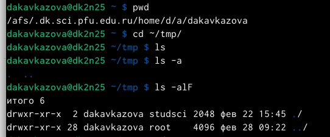
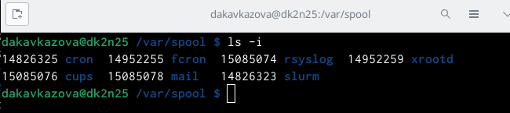
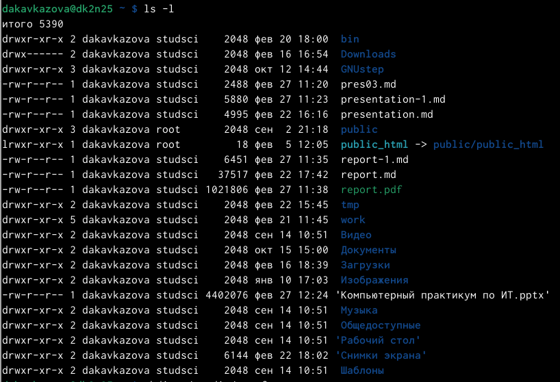
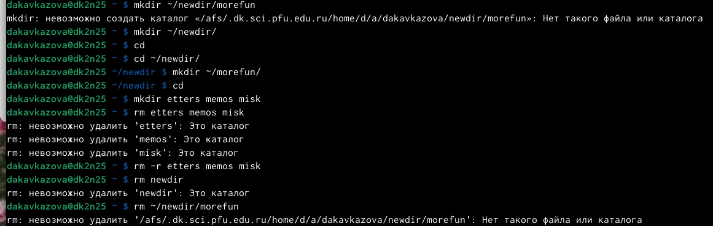
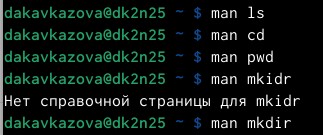
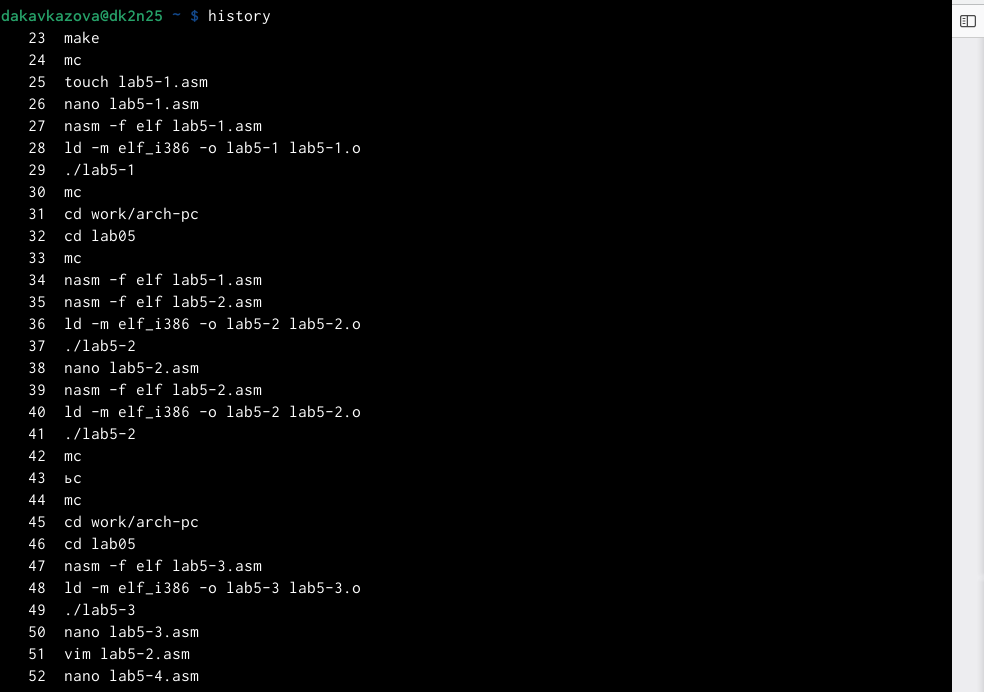
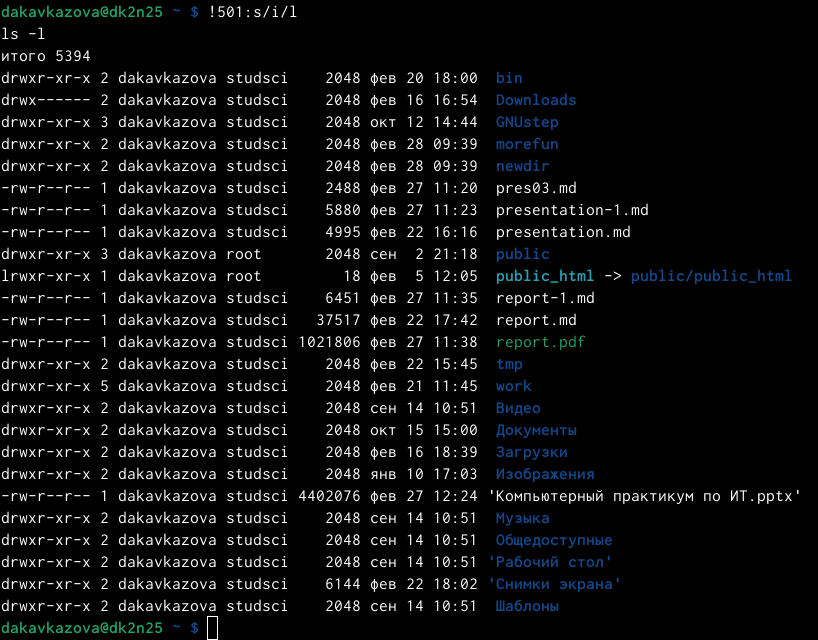

---
## Front matter
lang: ru-RU
title: Лабораторная работа №4
subtitle: Кавказова Диана Алексеевна
author:
author:
  - Кавказова Д.А.
institute:
  - Российский университет дружбы народов, Москва, Россия
date: 22 февраляя 2023

## i18n babel
babel-lang: russian
babel-otherlangs: english

## Formatting pdf
toc: false
toc-title: Содержание
slide_level: 2
aspectratio: 169
section-titles: true
theme: metropolis
header-includes:
 - \metroset{progressbar=frametitle,sectionpage=progressbar,numbering=fraction}
 - '\makeatletter'
 - '\beamer@ignorenonframefalse'
 - '\makeatother'
---

# Информация

## Докладчик

:::::::::::::: {.columns align=center}
::: {.column width="70%"}

  * Кваказова Диана Алексеевна
  * НБИбд-01-22
  * Российский университет дружбы народов
  
:::
::::::::::::::

## Актуальность

- Для учащихся в сфере IT необходимы навыки использования командной строки отчетов на основе маркдауна, чтобы в последующем легче формировать docx, pdf файлы. 

## Объект и предмет исследования

- Основы интерфейса взаимодействия
пользователя с системой Unix на уровне командной строки
- Операционные системы

## Цели и задачи

- Изучить материал по созданию сайта
- Выполнить необходимые действия поэтапно

## шаг 1

-  Указываем фио, название предмета в шапке отчета, заполняем отдельно пункт задания, цель и вывод работы.

{#fig:010 width=95%}

## шаг 1

- Определили полное имя нашего домашнего каталога. Перещлив каталог /tmp.
Вывели на экран содержимое каталога /tmp. Для этого использовали команду ls
с различными опциями. Разница в выводимой на экран информации отличается в подаче, терминал может вывыести просто название файлов ми дату создания, а может вывести ту же информацию с именем пользователя или же дописать сколько именно файлов хранится в данном каталоге.

{#fig:001 width=95%}

## шаг 2

- Определила что в каталоге /var/spool есть подкаталог с именем cron.
 
{#fig:002 width=95%}

## шаг 3

- Перешла в домашний каталог и вывела на экран его содержимое. Определила, что я являюсь файлов и подкаталогов.

{#fig:003 width=95%}

## шаг 4

- В домашнем каталоге создайте новый каталог с именем newdir.
В каталоге ~/newdir создала новый каталог с именем morefun.
В домашнем каталоге создала одной командой три новых каталога с именами
letters, memos, misk. Затем удалила эти каталоги одной командой.
Попробовала удалить ранее созданный каталог ~/newdir командой rm. Проверила,
каталог не был удалён. Удалила каталог ~/newdir/morefun из домашнего каталога. Проверила, что каталог не был удалён. Для того чтобы удалить использую rmdir.

{#fig:004 width=95%}

## шаг 5

- С помощью команды man определите, какую опцию команды ls нужно использовать для просмотра содержимое не только указанного каталога, но и подкаталогов,
входящих в него.С помощью команды man определите набор опций команды ls, позволяющий отсортировать по времени последнего изменения выводимый список содержимого каталога с развёрнутым описанием файлов. Используйте команду man для просмотра описания следующих команд: cd(переход), pwd(имя пользователя), mkdir(создание), rmdir(удаление каталогов), rm(удаление). 

{#fig:005 width=95%}

## шаг 6

- Используя информацию, полученную при помощи команды history, выполнила мо-
дификацию и исполнение нескольких команд из буфера команд следующим образом: вызовала команду historty и определила нужную мне 501 строчку, которую позже заменила на 503. 

{#fig:006 width=95%}

## шаг 7

- Вывод. В ходе работы мы изучили базовые команды по работе с  с системой посредством командной строки. Попробовали разные вариации похожих по действию комианд и научились пользоваться инструкцией man, а также при помощи history менять команды.

{#fig:007 width=95%}

:::
