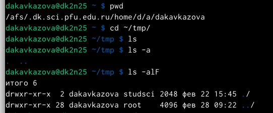
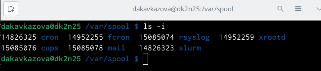
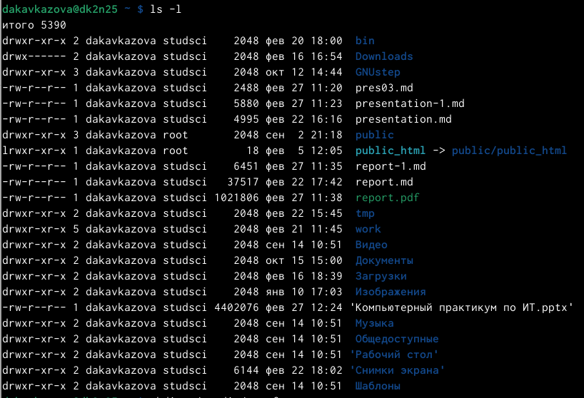
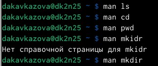
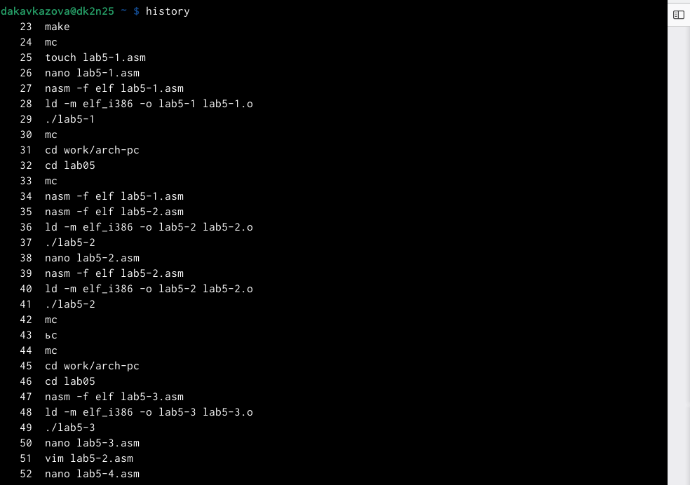
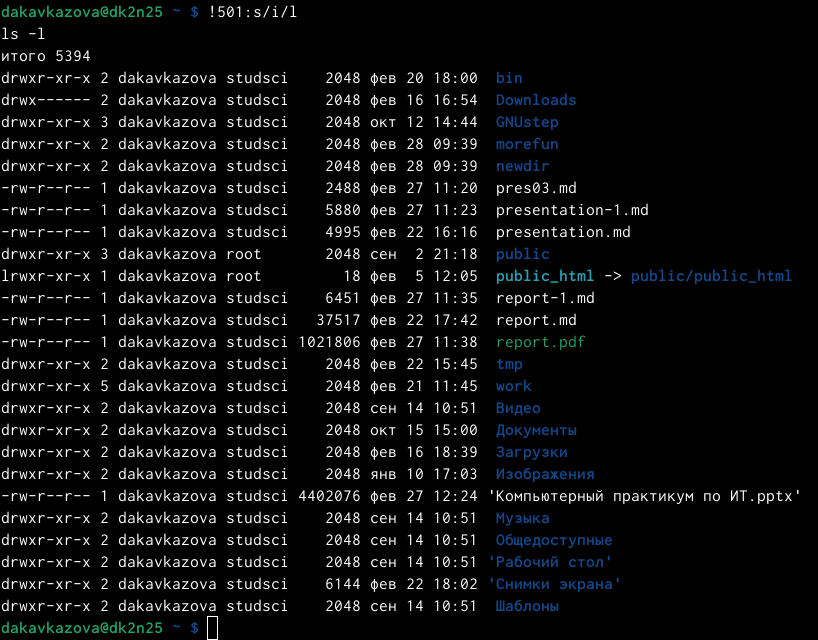

---
## Front matter
title: "Лабораторная работа №4"
subtitle: "Операционные системы"
author: "Кавказова Диана Алексеевна"

## Generic otions
lang: ru-RU
toc-title: "Содержание"

## Bibliography
bibliography: bib/cite.bib
csl: pandoc/csl/gost-r-7-0-5-2008-numeric.csl

## Pdf output format
toc: true # Table of contents
toc-depth: 2
lof: true # List of figures
lot: true # List of tables
fontsize: 12pt
linestretch: 1.5
papersize: a4
documentclass: scrreprt
## I18n polyglossia
polyglossia-lang:
  name: russian
  options:
	- spelling=modern
	- babelshorthands=true
polyglossia-otherlangs:
  name: english
## I18n babel
babel-lang: russian
babel-otherlangs: english
## Fonts
mainfont: PT Serif
romanfont: PT Serif
sansfont: PT Sans
monofont: PT Mono
mainfontoptions: Ligatures=TeX
romanfontoptions: Ligatures=TeX
sansfontoptions: Ligatures=TeX,Scale=MatchLowercase
monofontoptions: Scale=MatchLowercase,Scale=0.9
## Biblatex
biblatex: true
biblio-style: "gost-numeric"
biblatexoptions:
  - parentracker=true
  - backend=biber
  - hyperref=auto
  - language=auto
  - autolang=other*
  - citestyle=gost-numeric
## Pandoc-crossref LaTeX customization
figureTitle: "Рис."
tableTitle: "Таблица"
listingTitle: "Листинг"
lofTitle: "Список иллюстраций"
lotTitle: "Список таблиц"
lolTitle: "Листинги"
## Misc options
indent: true
header-includes:
  - \usepackage{indentfirst}
  - \usepackage{float} # keep figures where there are in the text
  - \floatplacement{figure}{H} # keep figures where there are in the text
---

# Цель работы

Приобретение практических навыков взаимодействия пользователя с системой по-
средством командной строки

# Задание

Прочесть теоретическое введение и выполнить работу в терминале.

# Выполнение лабораторной работы

1. Определили полное имя нашего домашнего каталога. Перещлив каталог /tmp.
Вывели на экран содержимое каталога /tmp. Для этого использовали команду ls
с различными опциями. Разница в выводимой на экран информации отличается в подаче, терминал может вывыести просто название файлов ми дату создания, а может вывести ту же информацию с именем пользователя или же дописать сколько именно файлов хранится в данном каталоге.

{#fig:001 width=95%}

2. Определила что в каталоге /var/spool есть подкаталог с именем cron.
 
{#fig:002 width=95%}

3. Перешла в домашний каталог и вывела на экран его содержимое. Опре-
делила, что я являюсь файлов и подкаталогов.

{#fig:003 width=95%}

4. В домашнем каталоге создайте новый каталог с именем newdir.
В каталоге ~/newdir создала новый каталог с именем morefun.
В домашнем каталоге создала одной командой три новых каталога с именами
letters, memos, misk. Затем удалила эти каталоги одной командой.
Попробовала удалить ранее созданный каталог ~/newdir командой rm. Проверила,
каталог не был удалён. Удалила каталог ~/newdir/morefun из домашнего каталога. Проверила, что каталог не был удалён. Для того чтобы удалить использую rmdir.

{#fig:004 width=95%}

5. С помощью команды man определите, какую опцию команды ls нужно использовать для просмотра содержимое не только указанного каталога, но и подкаталогов,
входящих в него.С помощью команды man определите набор опций команды ls, позволяющий отсортировать по времени последнего изменения выводимый список содержимого каталога с развёрнутым описанием файлов. Используйте команду man для просмотра описания следующих команд: cd(переход), pwd(имя пользователя), mkdir(создание), rmdir(удаление каталогов), rm(удаление). 

{#fig:005 width=95%}

6. Используя информацию, полученную при помощи команды history, выполнила мо-
дификацию и исполнение нескольких команд из буфера команд следующим образом: вызовала команду historty и определила нужную мне 501 строчку, которую позже заменила на 503. 

{#fig:006 width=95%}

{#fig:007 width=95%}

# Контрольные вопросы

1. Что такое командная строка - инструмент для передачи дейтвий которые должен выполнить компьютерю
2. pwd, realpath

3.  ls -F

4. Можно отредактировать скрытый файл и заметить что он отображается, в данном случае стоит использовать ls, а точнее ls -a.
 Пример: ls -a. Вывод: . ..

5. При помощи rm, rmdir можно удалить файл и каталог, можно это сделать
одной и той же командой. 
Пример: rm -r letters memos misk
Пример: rmdir  -r letters memos misk

6. history

7. Пример: "!501:s/i/l". Выбираем строчку, пишем её номер в начале, далее команду которую хотим заменить на следующую.

8. Используем запятые для того чтобы записать сразу несколько командю

9. Экранирование - способ заключения в кавычки одиночного символа. Экранируемый символ (\) сообщает интерпретатору, что следующий за этим символ воспринимается как обычный символ.
Пример: "echo "Мир: \"world\"."    # echo "Мир: \"world\".

10. Охарактеризуйте вывод информации на экран после выполнения команды ls с опцией

11. Относительный путь к файлу - это путь к файлу относительно текущей папки. Например, при использовании pwd.

12. Получить информацию об интересующей вас команде можно с помощью команды man. 
Man ls  выдаёт все варианты действий с комнадой.

13. Сочетание клавиш Ctr+C прерывает текущий процесс, запущенный в терминале.

# Выводы

В ходе работы мы изучили базовые команды по работе с  с системой посредством командной строки. Попробовали разные вариации похожих по действию комианд и научились пользоваться инструкцией man, а также при помощи history менять команды.
# Список литературы{.unnumbered}

::: {#refs}
:::
