---
## Front matter
lang: ru-RU
title: Лабораторная работа №5
subtitle: Кавказова Диана Алексеевна
author:
author:
  - Кавказова Д.А.
institute:
  - Российский университет дружбы народов, Москва, Россия
date: 9 марта 2023

## i18n babel
babel-lang: russian
babel-otherlangs: english

## Formatting pdf
toc: false
toc-title: Содержание
slide_level: 2
aspectratio: 169
section-titles: true
theme: metropolis
header-includes:
 - \metroset{progressbar=frametitle,sectionpage=progressbar,numbering=fraction}
 - '\makeatletter'
 - '\beamer@ignorenonframefalse'
 - '\makeatother'
---

# Информация

## Докладчик

:::::::::::::: {.columns align=center}
::: {.column width="70%"}

  * Кваказова Диана Алексеевна
  * НБИбд-01-22
  * Российский университет дружбы народов
  
:::
::::::::::::::

## Актуальность

- Для учащихся в сфере IT необходимо уметь работать с файлами через терминал на основе Linux.

## Объект и предмет исследования

- Основы интерфейса взаимодействия
пользователя с системой Unix на уровне командной строки
- Операционные системы

## Цели и задачи

- Изучить материал по созданию лабораторной
- Выполнить необходимые действия поэтапно

## шаг 1

- Выполнение 1 и 2 примера.

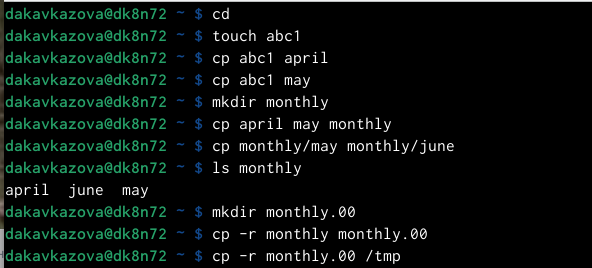{#fig:001 width=95%}

## шаг 2

- Выполнение 3 примера согласно инструкции.

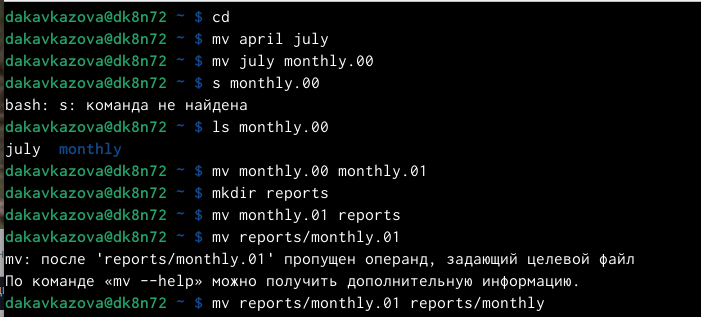{#fig:002 width=95%}

## шаг 3

- Выполнение 4 примера согласно инструкции.

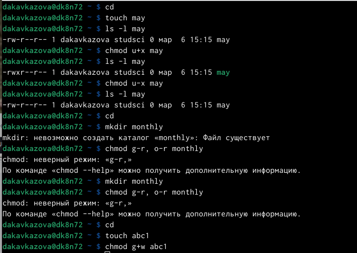{#fig:003 width=95%}

## шаг 4

- Выполнение второго пункта задания: 

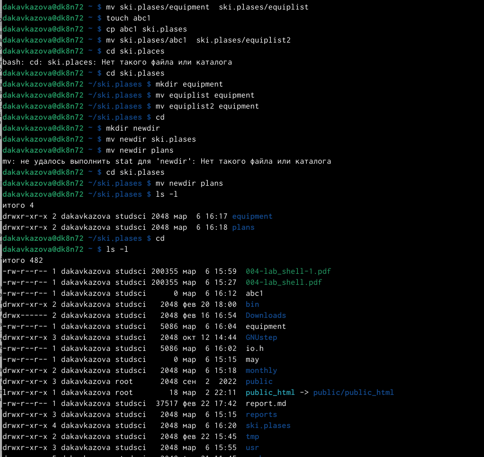{#fig:004 width=95%}

## шаг 5

- Просмотрели файл

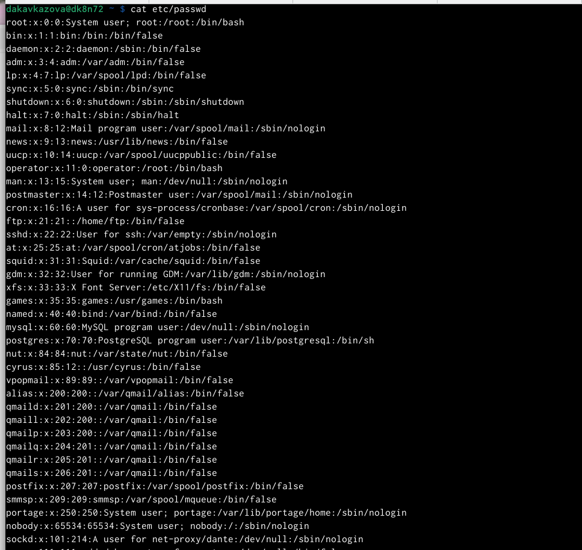{#fig:005 width=95%}permission

## шаг 6

- Скопировали  файл ~/feathers в файл ~/file.old.
- Переместили  файл ~/file.old в каталог ~/play.
- Скопирщвали каталог ~/play в каталог ~/fun.
- Переместили каталог ~/fun в каталог ~/play и назовите его games.
- Лишили владельца файла ~/feathers права на чтение.

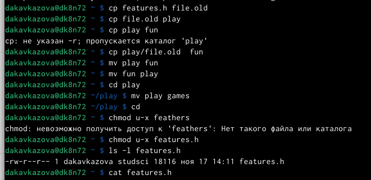{#fig:006 width=95%}

## шаг 7

- Когда мы попытались просмотреть файл ~/feathers командой
cat терминал выдал ограничение доступа.
- Мы попытались скопировать файл ~/feathers терминал выдал ограничение доступа.
- Дали владельцу файла ~/feathers право на чтение.

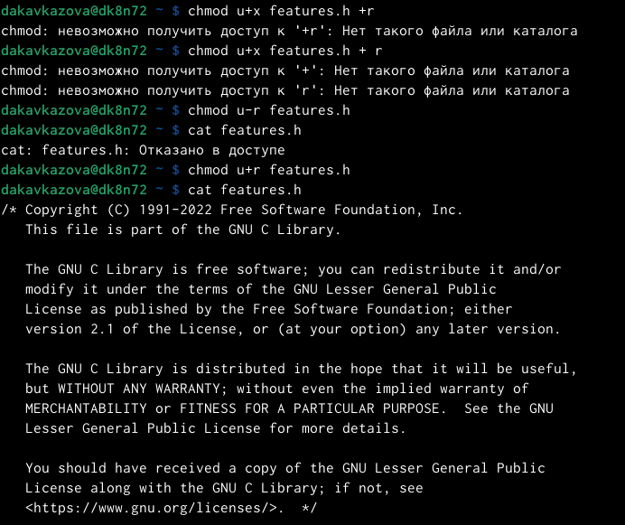{#fig:007 width=95%}

## шаг 8

- Лишили владельца каталога ~/play права на выполнение.
- Перешли в каталог ~/play. 
- Дали владельцу каталога ~/play право на выполнение

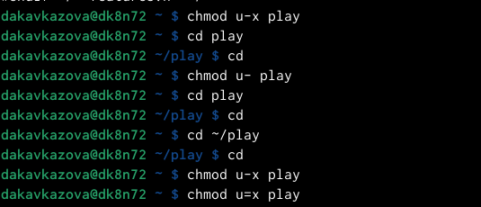{#fig:007 width=95%}

## шаг 9

- man mount

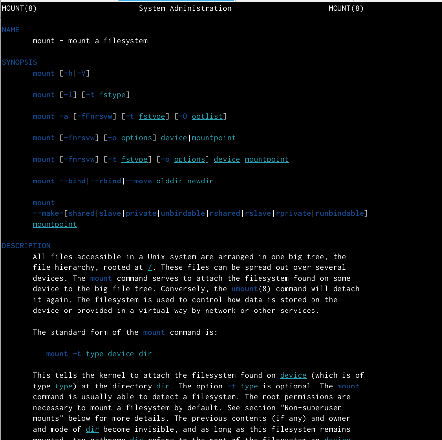{#fig:007 width=95%}

## шаг 10

- man fsck

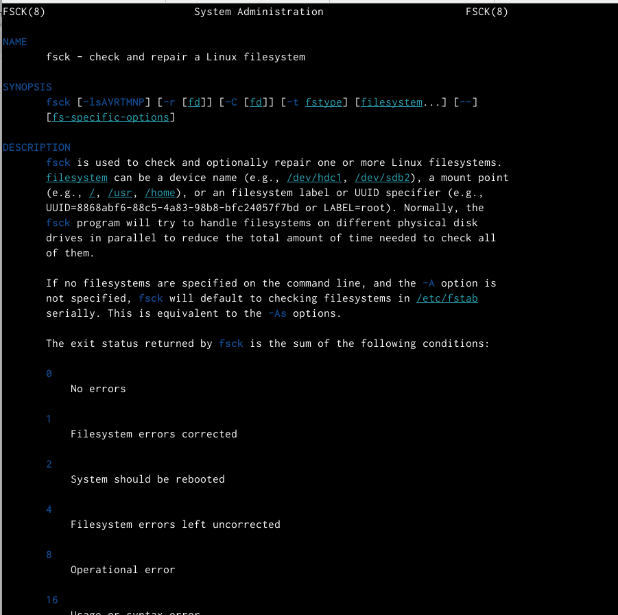{#fig:007 width=95%}

## шаг 11

- man mkfs

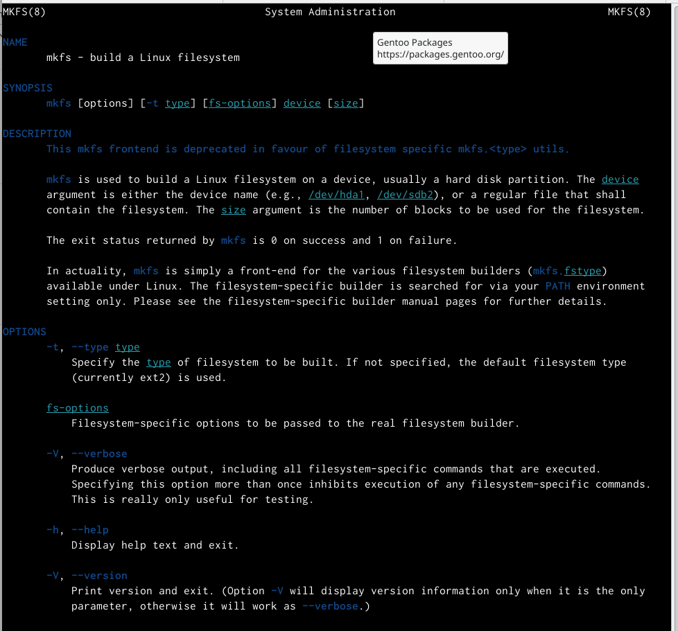{#fig:007 width=95%}

## шаг 12

- man kill

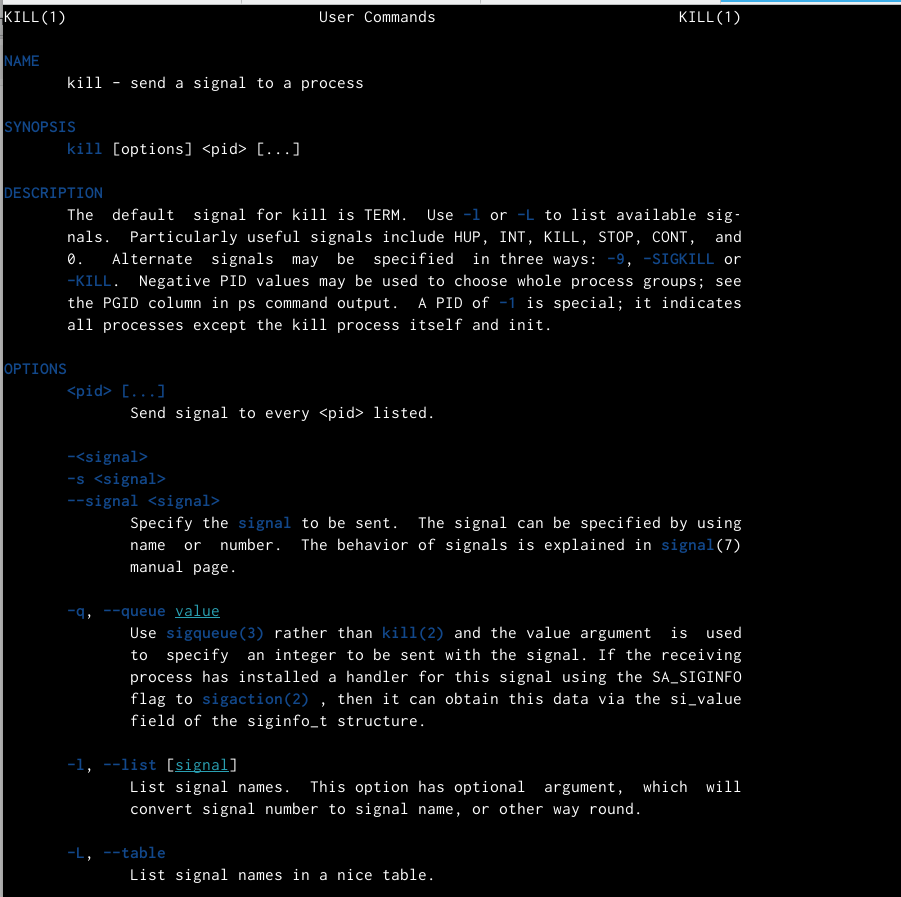{#fig:007 width=95%}

:::
