---
## Front matter
title: "Лабораторная работа №5"
subtitle: "Операционные системы"
author: "Кавказова Диана Алексеевна"

## Generic otions
lang: ru-RU
toc-title: "Содержание"

## Bibliography
bibliography: bib/cite.bib
csl: pandoc/csl/gost-r-7-0-5-2008-numeric.csl

## Pdf output format
toc: true # Table of contents
toc-depth: 2
lof: true # List of figures
lot: true # List of tables
fontsize: 12pt
linestretch: 1.5
papersize: a4
documentclass: scrreprt
## I18n polyglossia
polyglossia-lang:
  name: russian
  options:
	- spelling=modern
	- babelshorthands=true
polyglossia-otherlangs:
  name: english
## I18n babel
babel-lang: russian
babel-otherlangs: english
## Fonts
mainfont: PT Serif
romanfont: PT Serif
sansfont: PT Sans
monofont: PT Mono
mainfontoptions: Ligatures=TeX
romanfontoptions: Ligatures=TeX
sansfontoptions: Ligatures=TeX,Scale=MatchLowercase
monofontoptions: Scale=MatchLowercase,Scale=0.9
## Biblatex
biblatex: true
biblio-style: "gost-numeric"
biblatexoptions:
  - parentracker=true
  - backend=biber
  - hyperref=auto
  - language=auto
  - autolang=other*
  - citestyle=gost-numeric
## Pandoc-crossref LaTeX customization
figureTitle: "Рис."
tableTitle: "Таблица"
listingTitle: "Листинг"
lofTitle: "Список иллюстраций"
lotTitle: "Список таблиц"
lolTitle: "Листинги"
## Misc options
indent: true
header-includes:
  - \usepackage{indentfirst}
  - \usepackage{float} # keep figures where there are in the text
  - \floatplacement{figure}{H} # keep figures where there are in the text
---

# Цель работы

Ознакомление с файловой системой Linux, её структурой, именами и содержанием
каталогов. Приобретение практических навыков по применению команд для работы
с файлами и каталогами, по управлению процессами (и работами), по проверке исполь-
зования диска и обслуживанию файловой системы.

# Задание

1. Выполните все примеры, приведённые в первой части описания лабораторной работы.
2. Выполните следующие действия, зафиксировав в отчёте по лабораторной работе
используемые при этом команды и результаты их выполнения:
2.1. Скопируйте файл /usr/include/sys/io.h в домашний каталог и назовите его
equipment. Если файла io.h нет, то используйте любой другой файл в каталоге
/usr/include/sys/ вместо него.
2.2. В домашнем каталоге создайте директорию ~/ski.plases.
2.3. Переместите файл equipment в каталог ~/ski.plases.
2.4. Переименуйте файл ~/ski.plases/equipment в ~/ski.plases/equiplist.
2.5. Создайте в домашнем каталоге файл abc1 и скопируйте его в каталог
~/ski.plases, назовите его equiplist2.
2.6. Создайте каталог с именем equipment в каталоге ~/ski.plases.
2.7. Переместите файлы ~/ski.plases/equiplist и equiplist2 в каталог
~/ski.plases/equipment.
2.8. Создайте и переместите каталог ~/newdir в каталог ~/ski.plases и назовите
его plans.
Кулябов Д. С. и др. Операционные системы 53
3. Определите опции команды chmod, необходимые для того, чтобы присвоить перечис-
ленным ниже файлам выделенные права доступа, считая, что в начале таких прав
нет:
3.1. drwxr--r-- ... australia
3.2. drwx--x--x ... play
3.3. -r-xr--r-- ... my_os
3.4. -rw-rw-r-- ... feathers
При необходимости создайте нужные файлы.
4. Проделайте приведённые ниже упражнения, записывая в отчёт по лабораторной
работе используемые при этом команды:
4.1. Просмотрите содержимое файла /etc/password.
4.2. Скопируйте файл ~/feathers в файл ~/file.old.
4.3. Переместите файл ~/file.old в каталог ~/play.
4.4. Скопируйте каталог ~/play в каталог ~/fun.
4.5. Переместите каталог ~/fun в каталог ~/play и назовите его games.
4.6. Лишите владельца файла ~/feathers права на чтение.
4.7. Что произойдёт, если вы попытаетесь просмотреть файл ~/feathers командой
cat?
4.8. Что произойдёт, если вы попытаетесь скопировать файл ~/feathers?
4.9. Дайте владельцу файла ~/feathers право на чтение.
4.10. Лишите владельца каталога ~/play права на выполнение.
4.11. Перейдите в каталог ~/play. Что произошло?
4.12. Дайте владельцу каталога ~/play право на выполнение.
5. Прочитайте man по командам mount, fsck, mkfs, kill и кратко их охарактеризуйте,
приведя примеры.

# Выполнение лабораторной работы

1. Выполнение 1 и 2 примера.

{#fig:001 width=95%}

2. Выполнение 3 примера согласно инструкции.
 
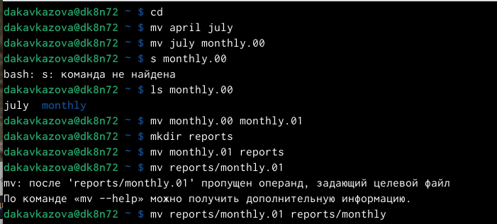{#fig:002 width=95%}

3. Выполнение 4 примера согласно инструкции.

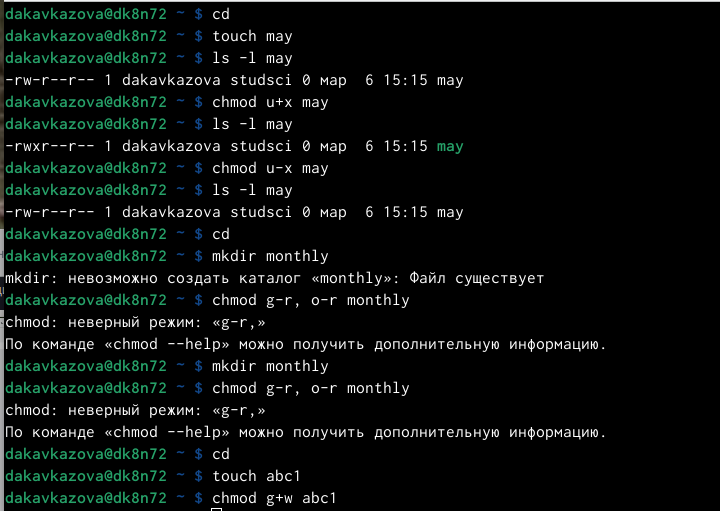{#fig:003 width=95%}

4. Выполнение второго пункта задания: 
2.1 скопировали файл /usr/include/sys/io.h в домашний каталог и назовите его
equipment. 
2.2. В домашнем каталоге создали директорию ~/ski.plases.
2.3. Переместили файл equipment в каталог ~/ski.plases.
2.4. Переименовали файл ~/ski.plases/equipment в ~/ski.plases/equiplist.
2.5. Создали в домашнем каталоге файл abc1 и скопировали его в каталог
~/ski.plases, назовали его equiplist2.
2.6. Создали каталог с именем equipment в каталоге ~/ski.plases.
2.7. Переместили файлы ~/ski.plases/equiplist и equiplist2 в каталог
~/ski.plases/equipment.
2.8. Создали и переместили каталог ~/newdir в каталог ~/ski.plases, назвали
его plans.

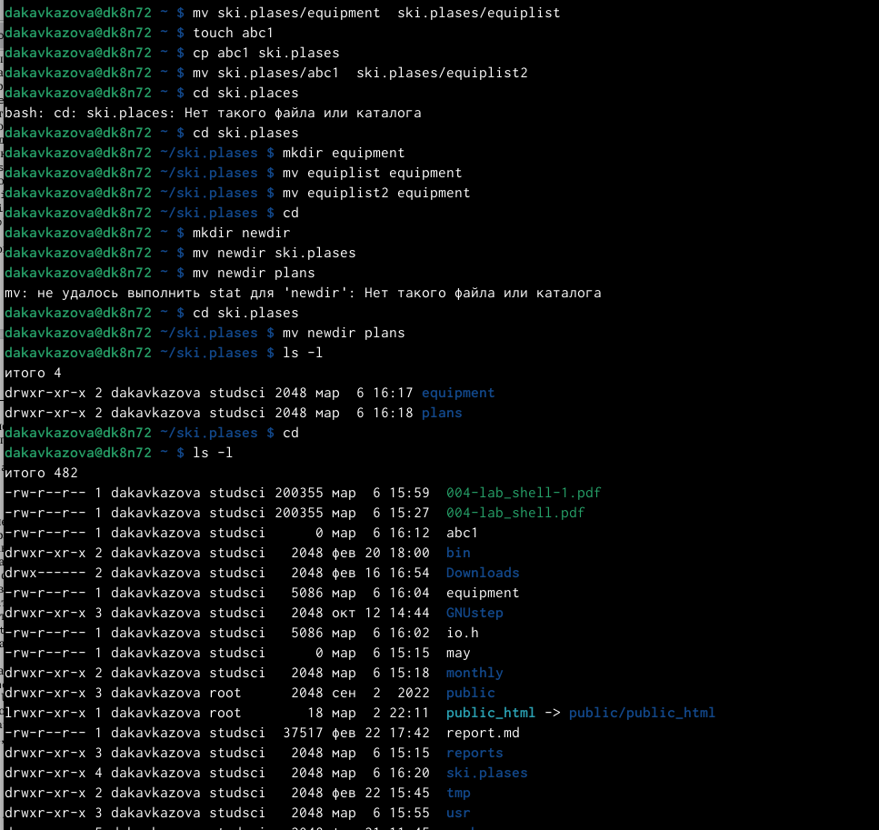{#fig:004 width=95%}

5. Просмотрели файл

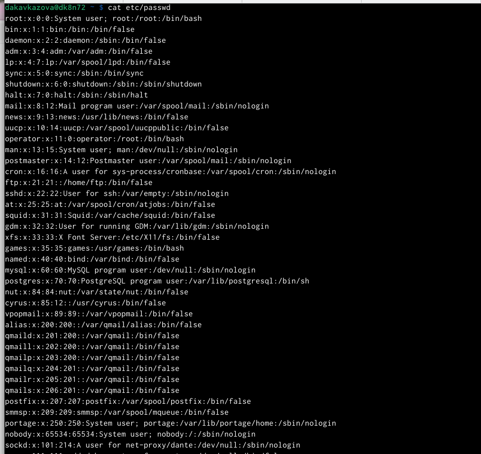{#fig:005 width=95%}

6.  Скопировали  файл ~/feathers в файл ~/file.old.
- Переместили  файл ~/file.old в каталог ~/play.
- Скопирщвали каталог ~/play в каталог ~/fun.
- Переместили каталог ~/fun в каталог ~/play и назовите его games.
- Лишили владельца файла ~/feathers права на чтение.

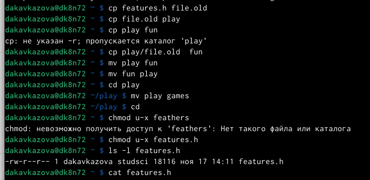{#fig:006 width=95%}

7. 
- Когда мы попытались просмотреть файл ~/feathers командой
cat терминал выдал ограничение доступа.
- Мы попытались скопировать файл ~/feathers терминал выдал ограничение доступа.
- Дали владельцу файла ~/feathers право на чтение.

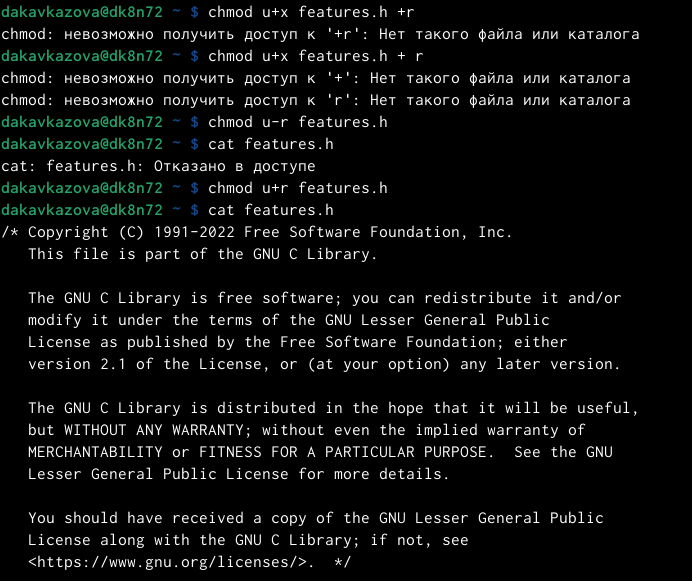{#fig:005 width=95%}

8. 
- Лишили владельца каталога ~/play права на выполнение.
- Перешли в каталог ~/play. 
- Дали владельцу каталога ~/play право на выполнение

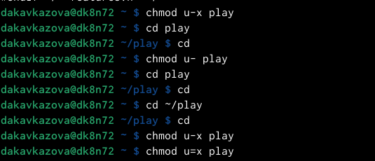{#fig:005 width=95%}

9. man mount

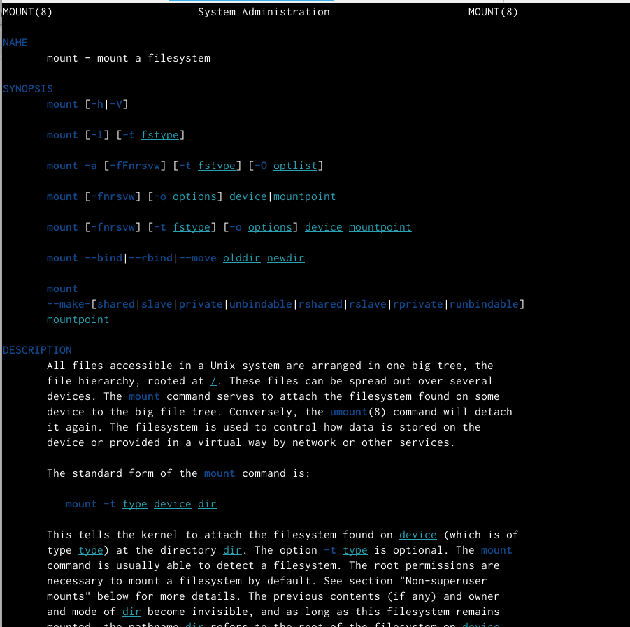{#fig:005 width=95%}

10. man fsck

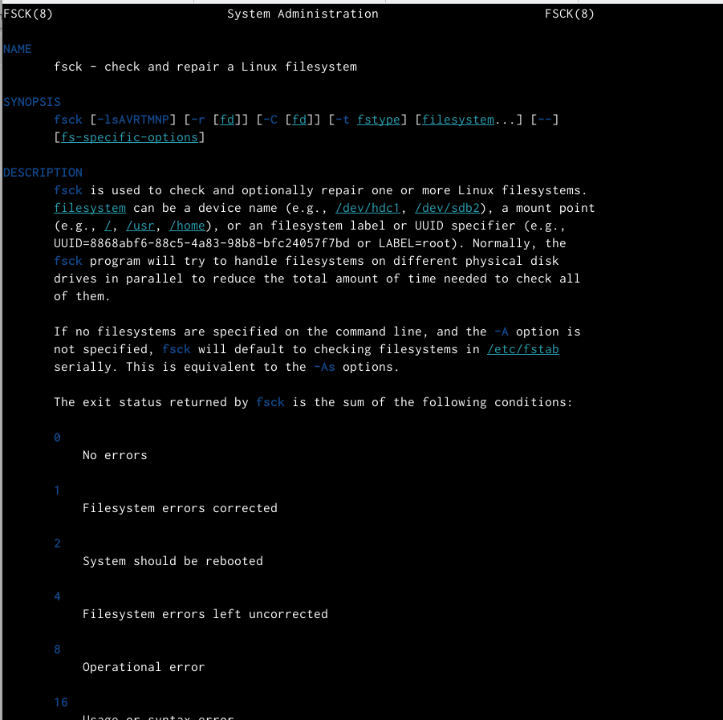{#fig:005 width=95%}

11. man mkfs

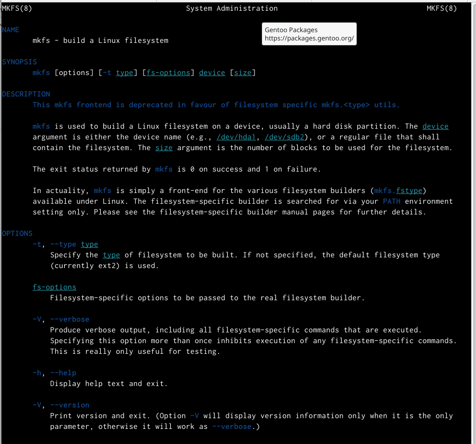{#fig:005 width=95%}

12. man kill

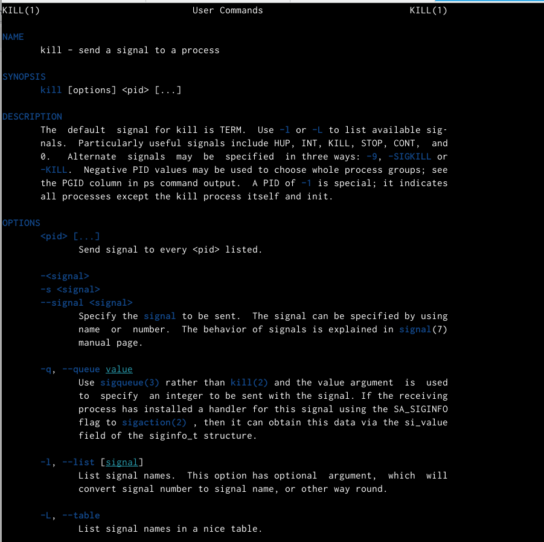{#fig:005 width=95%}

# Контрольные вопросы
1. Emacs представляет собой мощный экранный редактор текста, написанный на языке высокого уровня Elisp. 
2. Развитие Emacs в сторону его многогранности послужило причиной того, что и без того интуитивно программа стала чрезвычайно сложной в применении. В частности, управление осуществляется при помощи различных клавиатурных комбинаций, запомнить которые будет просто. 
3. Буфер - что-то, состоящее из текста. Окно - область с одним из буферов. 
4. В одном окне можно открыть больше 18 буферов. 
5. После запуска emacs без каких-либо параметров в основном окне отображается буфер *scratch* , который используется для оценки выражений Emacs Lisp, а также для заметок, которые вы не хотите сохранять. Этот буфер не сохраняется автоматически. 
6. Чтобы ввести следующую комбинацию C-c | я нажму клавиши: Control+C и Shift+\, и для C-c C-|: Control+C и Control+Shift+\. 
7. Поделить текущее окно на две части можно двумя комбинациями клавиш : C-x 3 или C-x 2. 
8. Настроить или расширить Emacs можно написав или изменив файл ~/.emacs. 
9. Клавиша выполняет фунуцию перемещения курсора в открытом окне также, как и многие другие клавиши ее можно переназначать. 
10. Редактор emacs показался мне удобен из-за возможности открытия нескольких окон с буферами и работать комбинациями клавиш в этом редакторе мне было проще. 

# Выводы

Здесь кратко описываются итоги проделанной работы.

# Список литературы{.unnumbered}

::: {#refs}
:::
