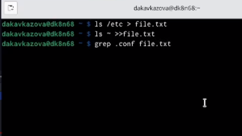
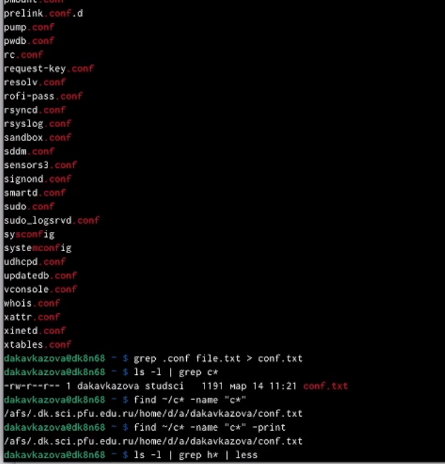
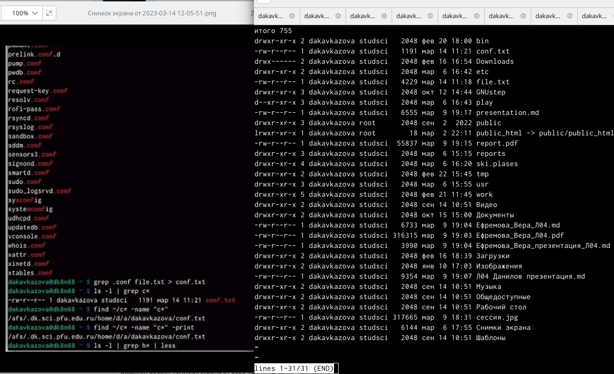
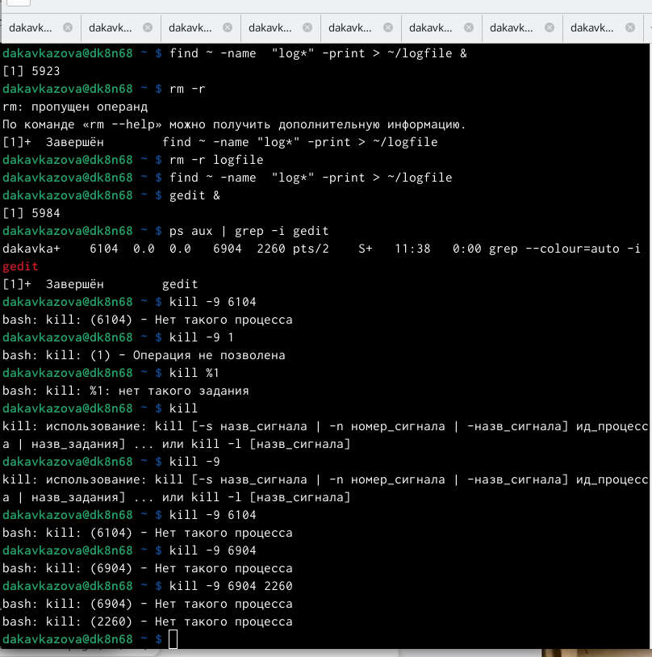
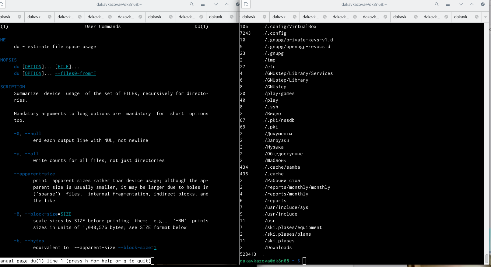
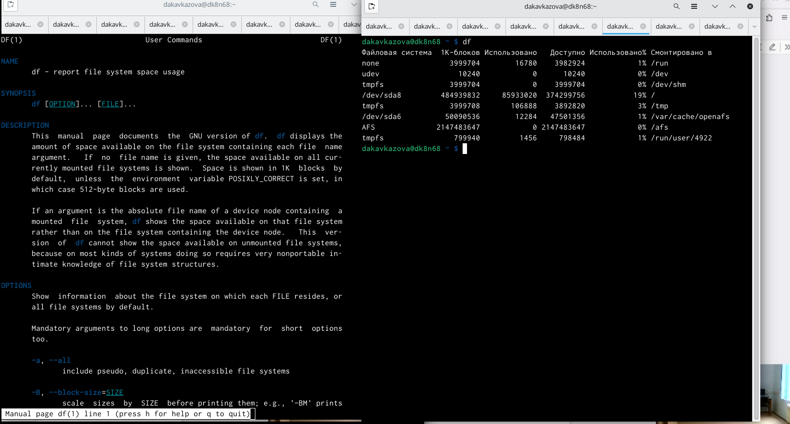
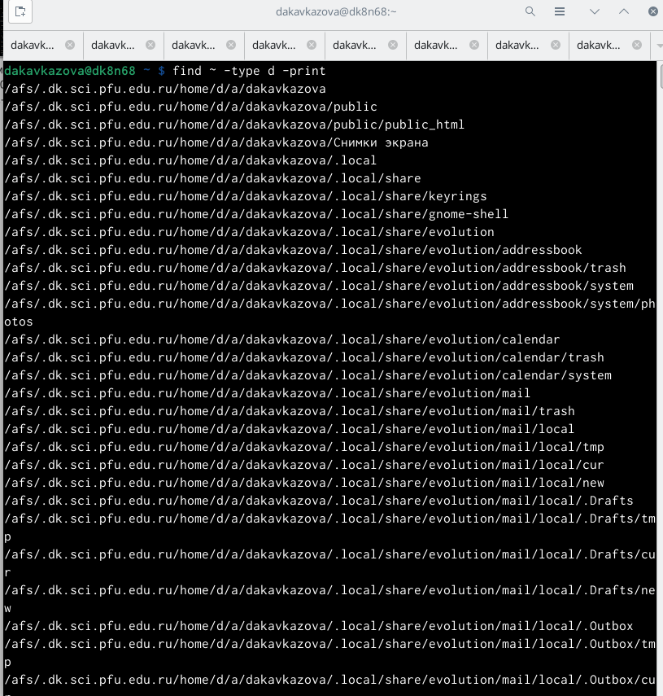

---
## Front matter
lang: ru-RU
title: Лабораторная работа №6
subtitle: Кавказова Диана Алексеевна
author:
author:
  - Кавказова Д.А.
institute:
  - Российский университет дружбы народов, Москва, Россия
date: 14 марта 2023

## i18n babel
babel-lang: russian
babel-otherlangs: english

## Formatting pdf
toc: false
toc-title: Содержание
slide_level: 2
aspectratio: 169
section-titles: true
theme: metropolis
header-includes:
 - \metroset{progressbar=frametitle,sectionpage=progressbar,numbering=fraction}
 - '\makeatletter'
 - '\beamer@ignorenonframefalse'
 - '\makeatother'
---

# Информация

## Докладчик

:::::::::::::: {.columns align=center}
::: {.column width="70%"}

  * Кваказова Диана Алексеевна
  * НБИбд-01-22
  * Российский университет дружбы народов
  
:::
::::::::::::::

## Актуальность

- Для учащихся в сфере IT необходимо уметь работать с файлами через терминал на основе Linux.

## Объект и предмет исследования

- Основы интерфейса взаимодействия
пользователя с системой Unix на уровне командной строки
- Операционные системы

## Цели и задачи

- Изучить материал по созданию лабораторной
- Выполнить необходимые действия поэтапно

## шаг 1

- Вошли в систему и записали в файл file.txt названия файлов, содержащихся в каталоге /etc. Дописали в этот же файл названия файлов, содержащихся в вашем домашнем каталоге. Вывели имена всех файлов из file.txt, имеющих расширение .conf, после чего записали их в новый текстовой файл conf.txt.

{#fig:001 width=95%}

## шаг 2

- Вывели имена всех файлов из file.txt, имеющих расширение .conf, после чего записали их в новый текстовой файл conf.txt.

{#fig:002 width=95%}

## шаг 3

- Определили, какие файлы в моем домашнем каталоге имеют имена, начинавшиеся
с символа c. Предложили несколько вариантов, как это сделать. Вывели на экран (по странично) имена файлов из каталога /etc, начинающиеся с символа h.

{#fig:003 width=95%}

## шаг 4

- Запустили в фоновом режиме процесс, который будет записывать в файл ~/logfile
файлы, имена которых начинаются с log. Удалили файл ~/logfile. Запустили из консоли в фоновом режиме редактор gedit. Определили идентификатор процесса gedit, используя команду ps, конвейер и фильтр grep. Прочли справку (man) команды kill, после чего попытались её использовать для завершения процесса gedit.

{#fig:004 width=95%}

## шаг 5

- Выполнили команду du, предварительно получив более подробную информацию
об этой команды, с помощью команды man. 
{#fig:005 width=95%}

## шаг 6

- Выполнили команду df, предварительно получив более подробную информацию
об этой команды, с помощью команды man. 

{#fig:006 width=95%}

## шаг 7

- Воспользовавшись справкой команды find, вывели имена всех директорий, имеющихся в вашем домашнем каталоге.

{#fig:007 width=95%}

:::
