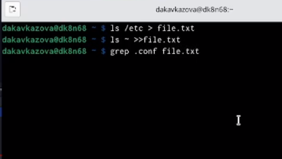
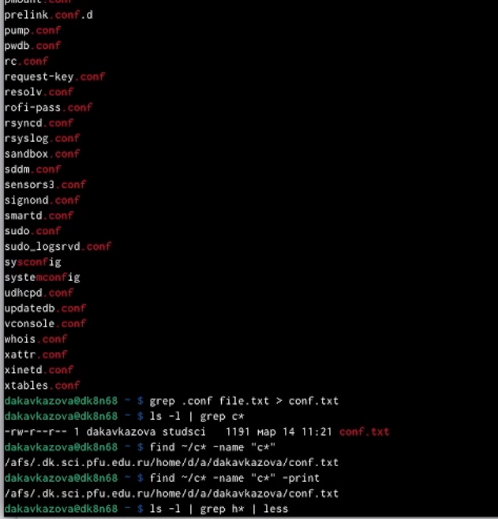
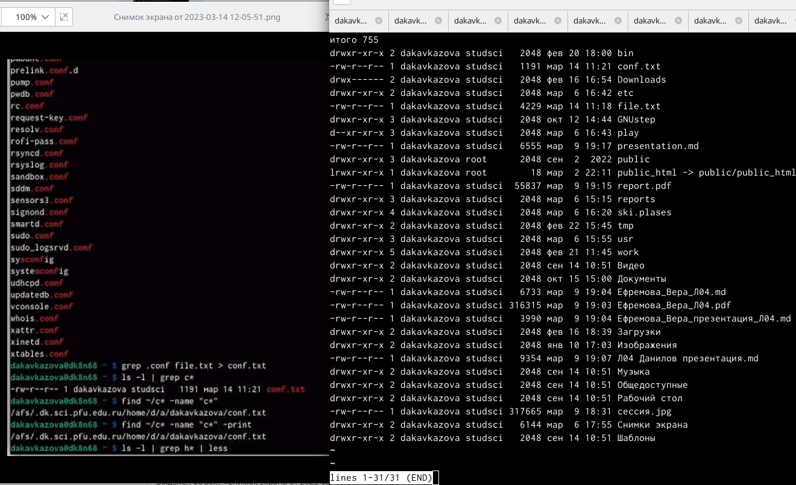
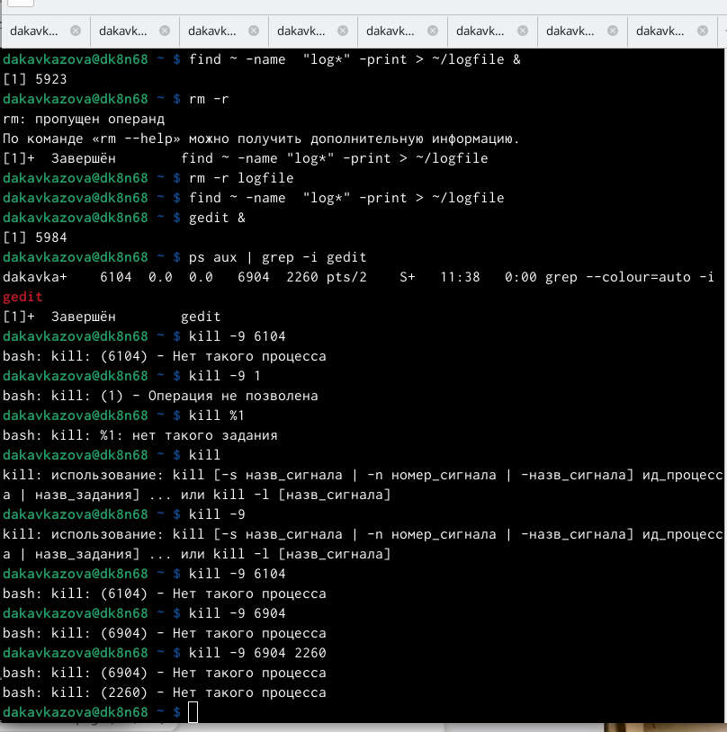
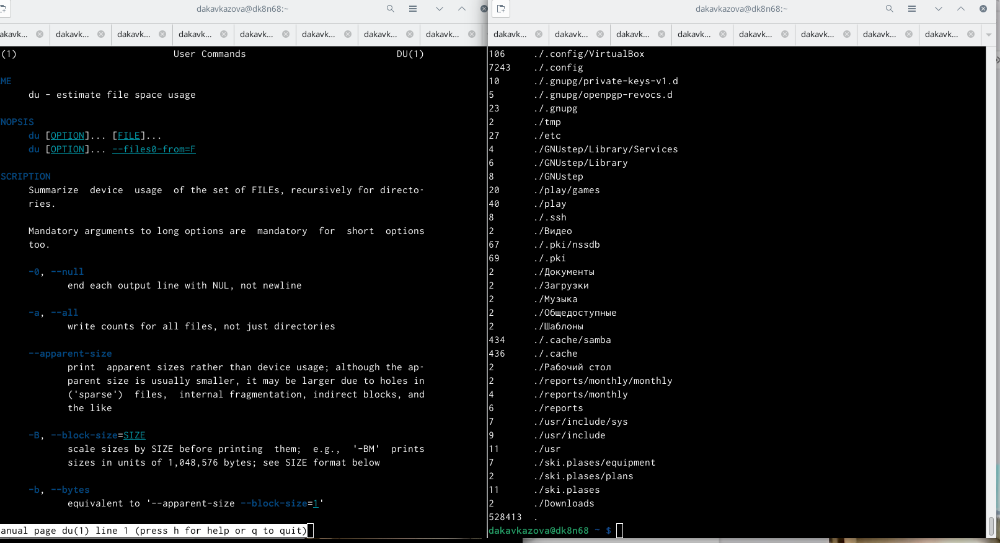
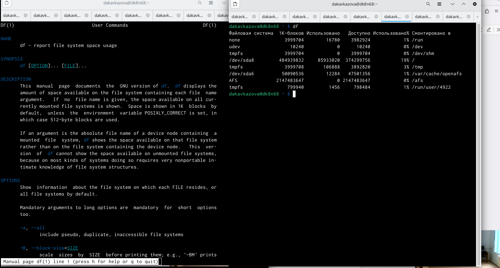
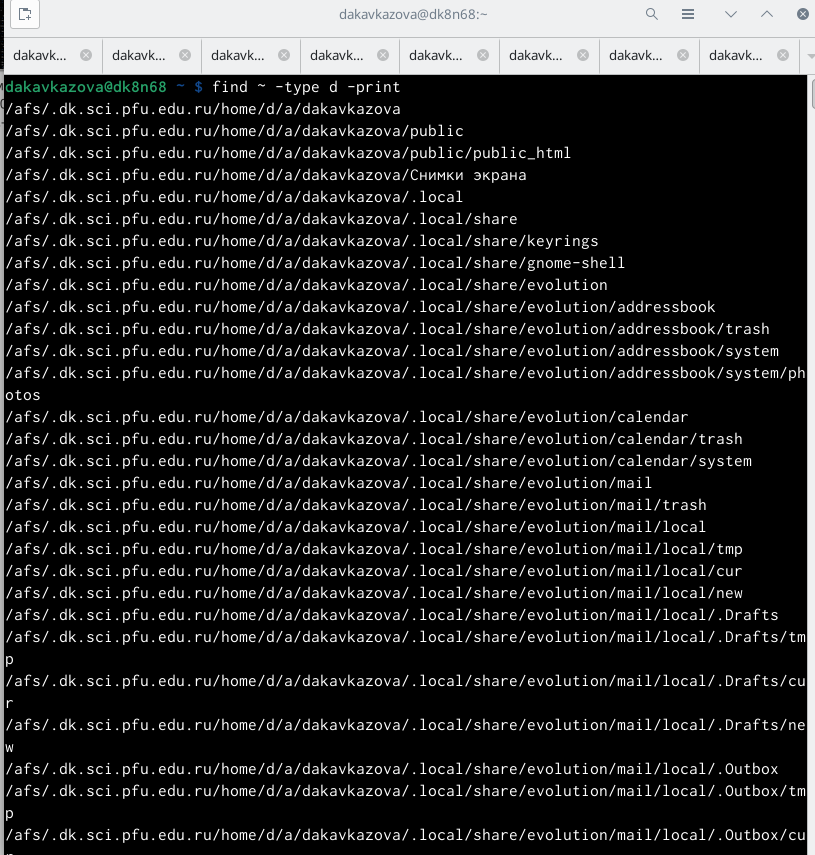

---
## Front matter
title: "Лабораторная работа №6"
subtitle: "Операционные системы"
author: "Кавказова Диана Алексеевна"

## Generic otions
lang: ru-RU
toc-title: "Содержание"

## Bibliography
bibliography: bib/cite.bib
csl: pandoc/csl/gost-r-7-0-5-2008-numeric.csl

## Pdf output format
toc: true # Table of contents
toc-depth: 2
lof: true # List of figures
lot: true # List of tables
fontsize: 12pt
linestretch: 1.5
papersize: a4
documentclass: scrreprt
## I18n polyglossia
polyglossia-lang:
  name: russian
  options:
	- spelling=modern
	- babelshorthands=true
polyglossia-otherlangs:
  name: english
## I18n babel
babel-lang: russian
babel-otherlangs: english
## Fonts
mainfont: PT Serif
romanfont: PT Serif
sansfont: PT Sans
monofont: PT Mono
mainfontoptions: Ligatures=TeX
romanfontoptions: Ligatures=TeX
sansfontoptions: Ligatures=TeX,Scale=MatchLowercase
monofontoptions: Scale=MatchLowercase,Scale=0.9
## Biblatex
biblatex: true
biblio-style: "gost-numeric"
biblatexoptions:
  - parentracker=true
  - backend=biber
  - hyperref=auto
  - language=auto
  - autolang=other*
  - citestyle=gost-numeric
## Pandoc-crossref LaTeX customization
figureTitle: "Рис."
tableTitle: "Таблица"
listingTitle: "Листинг"
lofTitle: "Список иллюстраций"
lotTitle: "Список таблиц"
lolTitle: "Листинги"
## Misc options
indent: true
header-includes:
  - \usepackage{indentfirst}
  - \usepackage{float} # keep figures where there are in the text
  - \floatplacement{figure}{H} # keep figures where there are in the text
---

# Цель работы

Ознакомление с инструментами поиска файлов и фильтрации текстовых данных.
Приобретение практических навыков: по управлению процессами (и заданиями), по
проверке использования диска и обслуживанию файловых систем.

# Задание

1. Осуществите вход в систему, используя соответствующее имя пользователя.
2. Запишите в файл file.txt названия файлов, содержащихся в каталоге /etc. Допи-
шите в этот же файл названия файлов, содержащихся в вашем домашнем каталоге.
3. Выведите имена всех файлов из file.txt, имеющих расширение .conf, после чего
запишите их в новый текстовой файл conf.txt.
4. Определите, какие файлы в вашем домашнем каталоге имеют имена, начинавшиеся
с символа c? Предложите несколько вариантов, как это сделать.
5. Выведите на экран (по странично) имена файлов из каталога /etc, начинающиеся
с символа h.
6. Запустите в фоновом режиме процесс, который будет записывать в файл ~/logfile
файлы, имена которых начинаются с log.
7. Удалите файл ~/logfile.
8. Запустите из консоли в фоновом режиме редактор gedit.
9. Определите идентификатор процесса gedit, используя команду ps, конвейер и фильтр
grep. Как ещё можно определить идентификатор процесса?
10. Прочтите справку (man) команды kill, после чего используйте её для завершения
процесса gedit.
11. Выполните команды df и du, предварительно получив более подробную информацию
об этих командах, с помощью команды man.
12. Воспользовавшись справкой команды find, выведите имена всех директорий, имею-
щихся в вашем домашнем каталоге.

# Выполнение лабораторной работы

1. Вошли в систему и записали в файл file.txt названия файлов, содержащихся в каталоге /etc. Дописали в этот же файл названия файлов, содержащихся в вашем домашнем каталоге. Вывели имена всех файлов из file.txt, имеющих расширение .conf, после чего записали их в новый текстовой файл conf.txt.

{#fig:001 width=95%}

2. Вывели имена всех файлов из file.txt, имеющих расширение .conf, после чего записали их в новый текстовой файл conf.txt.
 
{#fig:002 width=95%}

3. Определили, какие файлы в моем домашнем каталоге имеют имена, начинавшиеся
с символа c. Предложили несколько вариантов, как это сделать. Вывели на экран (по странично) имена файлов из каталога /etc, начинающиеся с символа h.

{#fig:003 width=95%}

4. Запустили в фоновом режиме процесс, который будет записывать в файл ~/logfile
файлы, имена которых начинаются с log. Удалили файл ~/logfile. Запустили из консоли в фоновом режиме редактор gedit. Определили идентификатор процесса gedit, используя команду ps, конвейер и фильтр grep. Прочли справку (man) команды kill, после чего попытались её использовать для завершения процесса gedit.

{#fig:004 width=95%}

5. Выполнили команду du, предварительно получив более подробную информацию
об этой команды, с помощью команды man. 

{#fig:005 width=95%}

6.  Выполнили команду df, предварительно получив более подробную информацию
об этой команды, с помощью команды man. 

{#fig:006 width=95%}

7. Воспользовавшись справкой команды find, вывели имена всех директорий, имеющихся в вашем домашнем каталоге.

{#fig:007 width=95%}

# Контрольные вопросы
1. Какие потоки ввода вывода вы знаете?
2. Объясните разницу между операцией > и >>.
3. Что такое конвейер?
4. Что такое процесс? Чем это понятие отличается от программы?
5. Что такое PID и GID?
6. Что такое задачи и какая команда позволяет ими управлять?
7. Найдите информацию об утилитах top и htop. Каковы их функции?
8. Назовите и дайте характеристику команде поиска файлов. Приведите примеры ис-
пользования этой команды.
9. Можно ли по контексту (содержанию) найти файл? Если да, то как?
10. Как определить объем свободной памяти на жёстком диске?
11. Как определить объем вашего домашнего каталога?
12. Как удалить зависший процесс?

# Выводы

Ознакомились с инструментами поиска файлов и фильтрации текстовых данных.
Приобрели следующие практические навыки: по управлению процессами (и заданиями), по проверке использования диска и обслуживанию файловых систем.

# Список литературы{.unnumbered}

::: {#refs}
:::
