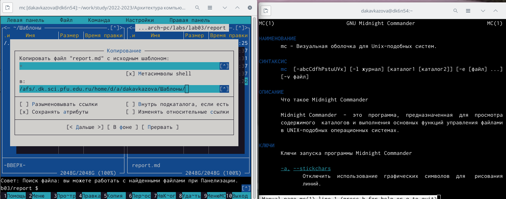
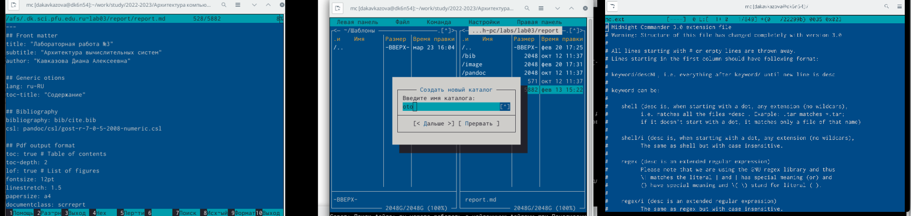
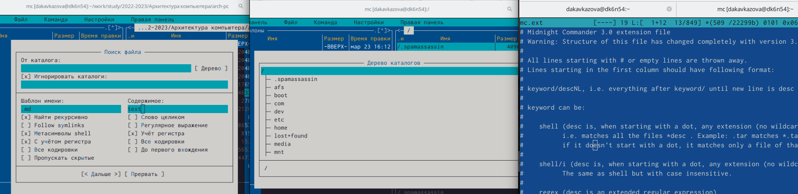
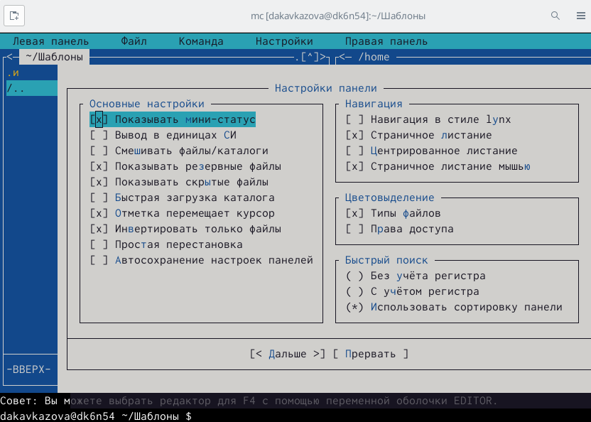
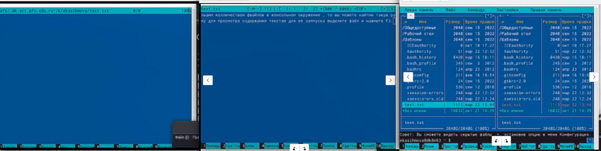

---
## Front matter
lang: ru-RU
title: Лабораторная работа №7
subtitle: Кавказова Диана Алексеевна
author:
author:
  - Кавказова Д.А.
institute:
  - Российский университет дружбы народов, Москва, Россия
date: 23 марта 2023

## i18n babel
babel-lang: russian
babel-otherlangs: english

## Formatting pdf
toc: false
toc-title: Содержание
slide_level: 2
aspectratio: 169
section-titles: true
theme: metropolis
header-includes:
 - \metroset{progressbar=frametitle,sectionpage=progressbar,numbering=fraction}
 - '\makeatletter'
 - '\beamer@ignorenonframefalse'
 - '\makeatother'
---

# Информация

## Докладчик

:::::::::::::: {.columns align=center}
::: {.column width="70%"}

  * Кваказова Диана Алексеевна
  * НБИбд-01-22
  * Российский университет дружбы народов
  
:::
::::::::::::::

## Актуальность

- Для учащихся в сфере IT необходимо уметь работать с файлами через терминал на основе Linux.

## Объект и предмет исследования

- Основы интерфейса взаимодействия
пользователя с системой Unix на уровне командной строки
- Операционные системы

## Цели и задачи

- Изучить материал по созданию лабораторной
- Выполнить необходимые действия поэтапно

## шаг 1

- Изучить информацию о mc, вызвав в командной строке man mc. Запустили из командной строки mc, изучите его структуру и меню.

{#fig:001 width=95%}

## шаг 2

- Выполнили несколько операций в mc, используя управляющие клавиши (операции
с панелями; выделение/отмена выделения файлов, копирование/перемещение фай-
лов, получение информации о размере и правах доступа на файлы и/или каталоги
и т.п.) Выполнили основные команды меню левой (или правой) панели. Оценили степень
подробности вывода информации о файлах.
Используя возможности подменю Файл , выполнили:
– просмотр содержимого текстового файла;
– редактирование содержимого текстового файла (без сохранения результатов
редактирования);
– создание каталога;
– копирование в файлов в созданный каталог.
 

{#fig:002 width=95%}

## шаг 3

- С помощью соответствующих средств подменю Команда осуществили:
– поиск в файловой системе файла с заданными условиями (например, файла
с расширением .c или .cpp, содержащего строку main);
– выбор и повторение одной из предыдущих команд;
– переход в домашний каталог;
– анализ файла меню и файла расширений

{#fig:003 width=95%}

## шаг 4

- Вызовали подменю Настройки . Освоили операции, определяющие структуру экрана mc
(Full screen, Double Width, Show Hidden Files и т.д.)

{#fig:004 width=95%}

## шаг 5

- Создали текстовой файл text.txt. 
Открыаваем этот файл с помощью встроенного в mc редактора.
Вставляем в открытый файл небольшой фрагмент текста, скопированный из любого
другого файла или Интернета.
 Проделаем с текстом следующие манипуляции, используя горячие Cоохраним и закройте файл. Откроем файл с исходным текстом на некотором языке программирования (напри-
мер C или Java). Используем меню редактора, включите подсветку синтаксиса, если она не включена,
или выключите, если она включена.

{#fig:005 width=95%}

##Вывод

Освоили основных возможностей командной оболочки Midnight Commander. Приоб-
ретение навыков практической работы по просмотру каталогов и файлов; манипуляций
с ними.

:::
