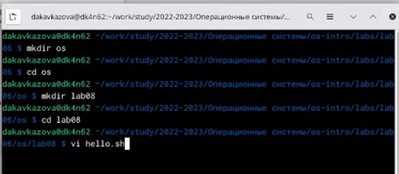
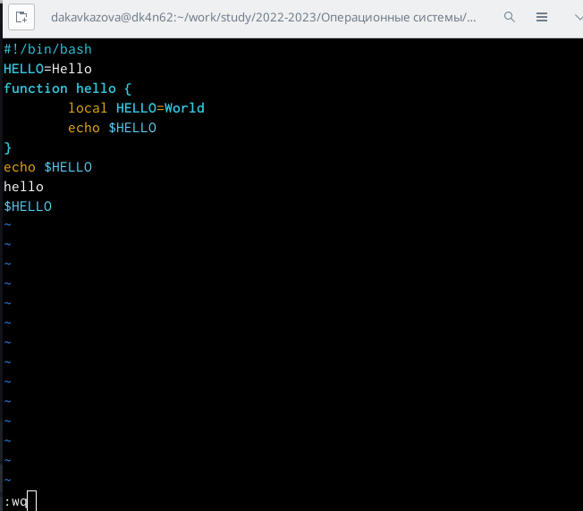
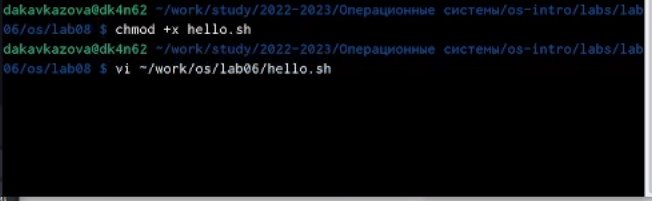
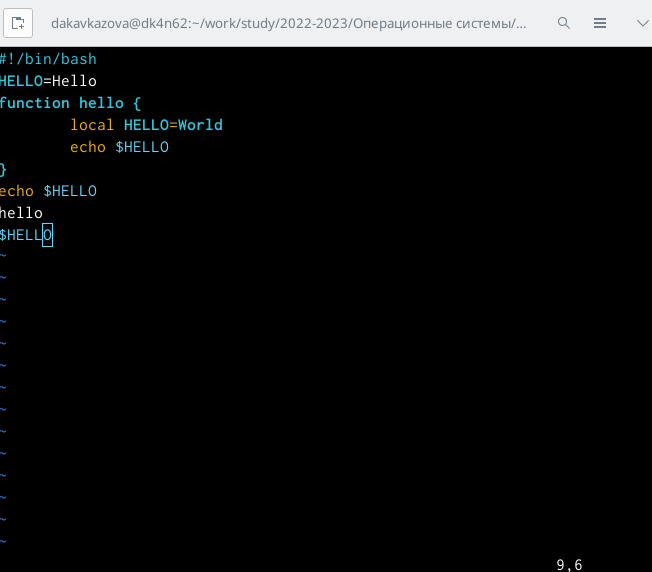

---
## Front matter
lang: ru-RU
title: Лабораторная работа №7
subtitle: Кавказова Диана Алексеевна
author:
author:
  - Кавказова Д.А.
institute:
  - Российский университет дружбы народов, Москва, Россия
date: 27 марта 2023

## i18n babel
babel-lang: russian
babel-otherlangs: english

## Formatting pdf
toc: false
toc-title: Содержание
slide_level: 2
aspectratio: 169
section-titles: true
theme: metropolis
header-includes:
 - \metroset{progressbar=frametitle,sectionpage=progressbar,numbering=fraction}
 - '\makeatletter'
 - '\beamer@ignorenonframefalse'
 - '\makeatother'
---

# Информация

## Докладчик

:::::::::::::: {.columns align=center}
::: {.column width="70%"}

  * Кваказова Диана Алексеевна
  * НБИбд-01-22
  * Российский университет дружбы народов
  
:::
::::::::::::::

## Актуальность

- Для учащихся в сфере IT необходимо уметь работать с файлами через терминал на основе Linux.

## Объект и предмет исследования

- Основы интерфейса взаимодействия
пользователя с системой Unix на уровне командной строки
- Операционные системы

## Цели и задачи

- Изучить материал по созданию лабораторной
- Выполнить необходимые действия поэтапно

## шаг 1

- Выполняем первые три пункта из списка заданий

{#fig:001 width=95%}

## шаг 2

- Работаем с редактором строго по инструкции, нажмимаем клавишу Esc для перехода в командный режим после завершения ввода
текста. Переходим в режим последней строки и внизу экрана появляется приглашение в виде двоеточия. Нажмимаем w (записать) и q (выйти), а затем нажмимаем клавишу Enter для сохранения текста и завершения работы.
 
{#fig:002 width=95%}

## шаг 3

- Сделаем файл исполняемым chmod +x hello.sh .
Вызываем vi на редактирование файла vi ~/work/os/lab06/hello.sh

{#fig:003 width=95%}

## шаг 4

- Выполняем полностью все 10 пунктов задания2

{#fig:004 width=95%}

## Вывод

Познакомились с операционной системой Linux. Получили практические навыки рабо-
ты с редактором vi, установленным по умолчанию практически во всех дистрибутивах.

:::
