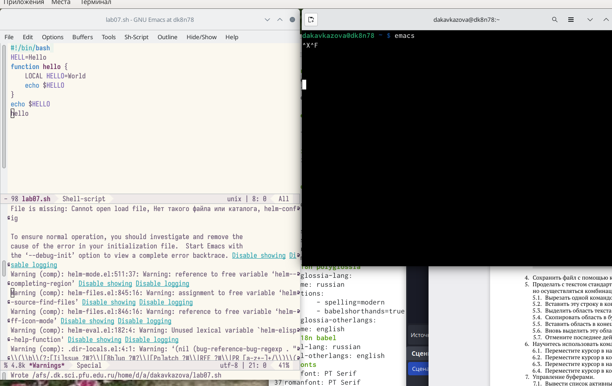
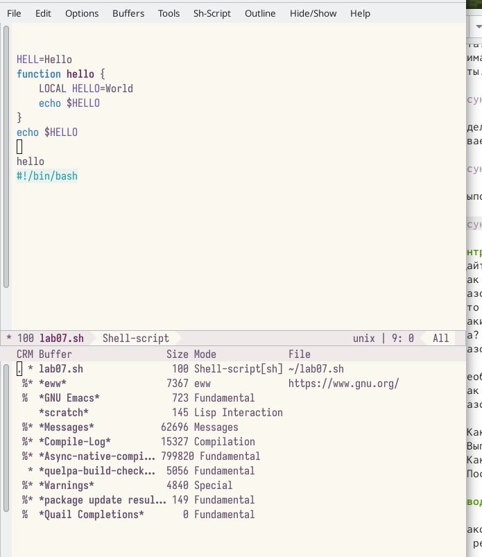
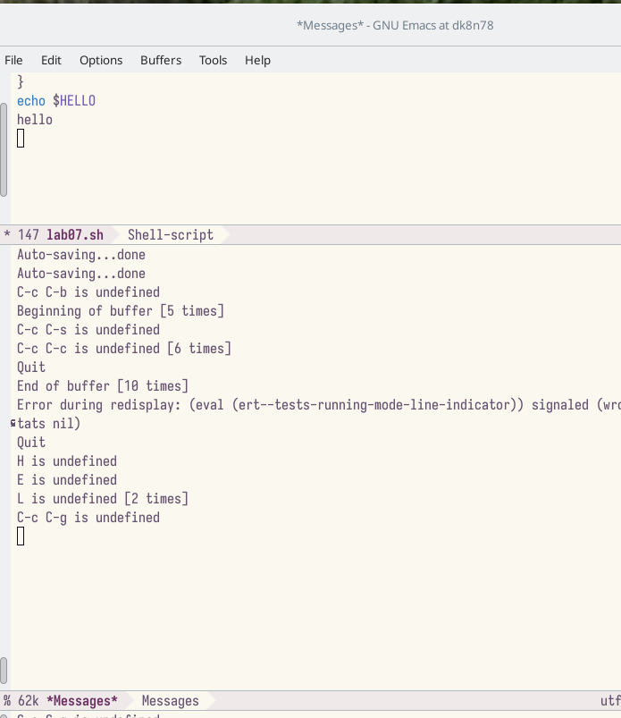
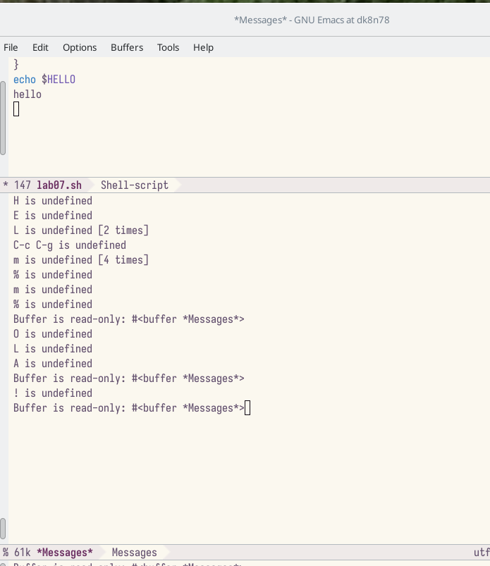

---
## Front matter
lang: ru-RU
title: Лабораторная работа №9
subtitle: Кавказова Диана Алексеевна
author:
author:
  - Кавказова Д.А.
institute:
  - Российский университет дружбы народов, Москва, Россия
date: 27 апреля 2023

## i18n babel
babel-lang: russian
babel-otherlangs: english

## Formatting pdf
toc: false
toc-title: Содержание
slide_level: 2
aspectratio: 169
section-titles: true
theme: metropolis
header-includes:
 - \metroset{progressbar=frametitle,sectionpage=progressbar,numbering=fraction}
 - '\makeatletter'
 - '\beamer@ignorenonframefalse'
 - '\makeatother'
---

# Информация

## Докладчик

:::::::::::::: {.columns align=center}
::: {.column width="70%"}

  * Кваказова Диана Алексеевна
  * НБИбд-01-22
  * Российский университет дружбы народов
  
:::
::::::::::::::

## Актуальность

- Для учащихся в сфере IT необходимо уметь работать с файлами через терминал на основе Linux.

## Объект и предмет исследования

- Основы интерфейса взаимодействия
пользователя с системой Unix на уровне командной строки
- Операционные системы

## Цели и задачи

- Изучить материал по созданию лабораторной
- Выполнить необходимые действия поэтапно

## шаг 1

- Открываем  emacs. Создать файл lab07.sh с помощью комбинации Ctrl-x Ctrl-f (C-x C-f). Набираем текст. Сохранить файл с помощью комбинации Ctrl-x Ctrl-s (C-x C-s). 

{#fig:001 width=95%}

## шаг 2

- Проделаем с текстом стандартные процедуры редактирования, каждое действие долж-
но осуществляться комбинацией клавиш.
5.1. Вырезать одной командой целую строку (С-k).
5.2. Вставить эту строку в конец файла (C-y).
5.3. Выделить область текста (C-space).
5.4. Скопировать область в буфер обмена (M-w).
5.5. Вставить область в конец файла.
5.6. Вновь выделить эту область и на этот раз вырезать её (C-w).
5.7. Отмените последнее действие (C-/).
 
{#fig:002 width=95%}

## шаг 3

- Переключимся в режим поиска (C-s) и найдём несколько слов, присутствующих
в тексте.
Переключимся между результатами поиска, нажимая C-s.

{#fig:003 width=95%}

## шаг 4

- Перейдём в режим поиска и замены (M-%), введите текст, который следует найти
и заменим, нажмите Enter , затем введём текст для замены. После того как будут
подсвечены результаты поиска, нажмём ! для подтверждения замены.

{#fig:004 width=95%}

## Вывод

Познакомилась с операционной системой Linux. Получила практические навыки рабо-
ты с редактором Emacs.

:::
