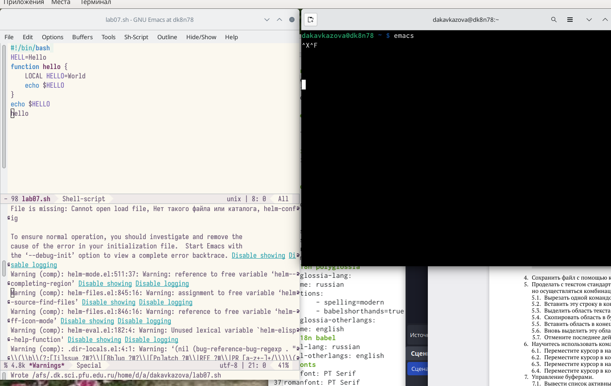
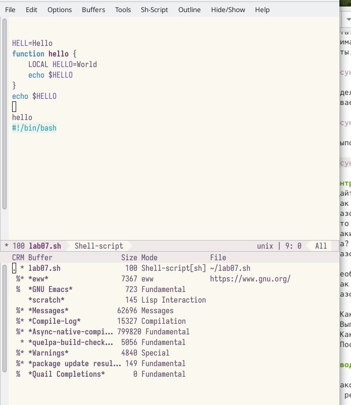
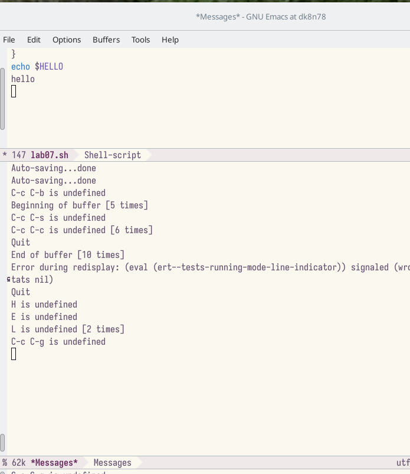
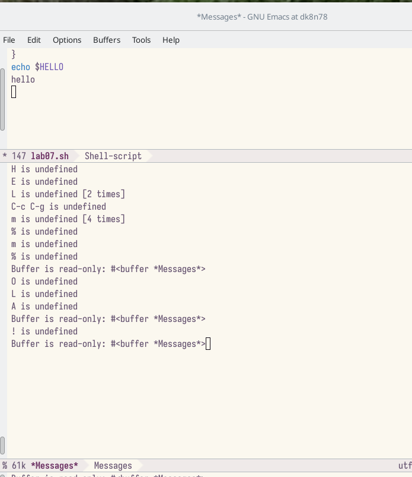

---
## Front matter
title: "Лабораторная работа №9"
subtitle: "Операционные системы"
author: "Кавказова Диана Алексеевна"

## Generic otions
lang: ru-RU
toc-title: "Содержание"

## Bibliography
bibliography: bib/cite.bib
csl: pandoc/csl/gost-r-7-0-5-2008-numeric.csl

## Pdf output format
toc: true # Table of contents
toc-depth: 2
lof: true # List of figures
lot: true # List of tables
fontsize: 12pt
linestretch: 1.5
papersize: a4
documentclass: scrreprt
## I18n polyglossia
polyglossia-lang:
  name: russian
  options:
	- spelling=modern
	- babelshorthands=true
polyglossia-otherlangs:
  name: english
## I18n babel
babel-lang: russian
babel-otherlangs: english
## Fonts
mainfont: PT Serif
romanfont: PT Serif
sansfont: PT Sans
monofont: PT Mono
mainfontoptions: Ligatures=TeX
romanfontoptions: Ligatures=TeX
sansfontoptions: Ligatures=TeX,Scale=MatchLowercase
monofontoptions: Scale=MatchLowercase,Scale=0.9
## Biblatex
biblatex: true
biblio-style: "gost-numeric"
biblatexoptions:
  - parentracker=true
  - backend=biber
  - hyperref=auto
  - language=auto
  - autolang=other*
  - citestyle=gost-numeric
## Pandoc-crossref LaTeX customization
figureTitle: "Рис."
tableTitle: "Таблица"
listingTitle: "Листинг"
lofTitle: "Список иллюстраций"
lotTitle: "Список таблиц"
lolTitle: "Листинги"
## Misc options
indent: true
header-includes:
  - \usepackage{indentfirst}
  - \usepackage{float} # keep figures where there are in the text
  - \floatplacement{figure}{H} # keep figures where there are in the text
---

# Цель работы

Познакомиться с операционной системой Linux. Получить практические навыки рабо-
ты с редактором Emacs.

# Выполнение лабораторной работы

1. Открываем  emacs. Создать файл lab07.sh с помощью комбинации Ctrl-x Ctrl-f (C-x C-f). Набираем текст. Сохранить файл с помощью комбинации Ctrl-x Ctrl-s (C-x C-s). 

{#fig:001 width=90%}

2. 
Проделаем с текстом стандартные процедуры редактирования, каждое действие долж-
но осуществляться комбинацией клавиш.
5.1. Вырезать одной командой целую строку (С-k).
5.2. Вставить эту строку в конец файла (C-y).
5.3. Выделить область текста (C-space).
5.4. Скопировать область в буфер обмена (M-w).
5.5. Вставить область в конец файла.
5.6. Вновь выделить эту область и на этот раз вырезать её (C-w).
5.7. Отмените последнее действие (C-/).

{#fig:001 width=90%}

3. 
Переключимся в режим поиска (C-s) и найдём несколько слов, присутствующих
в тексте.
Переключимся между результатами поиска, нажимая C-s.

{#fig:001 width=90%}

4. Перейдём в режим поиска и замены (M-%), введите текст, который следует найти
и заменим, нажмите Enter , затем введём текст для замены. После того как будут
подсвечены результаты поиска, нажмём ! для подтверждения замены.

{#fig:001 width=90%}

# Контрольные вопросы
1. Кратко охарактеризуйте редактор emacs.
2. Какие особенности данного редактора могут сделать его сложным для освоения но-
вичком?
3. Своими словами опишите, что такое буфер и окно в терминологии emacs’а.
4. Можно ли открыть больше 10 буферов в одном окне?
5. Какие буферы создаются по умолчанию при запуске emacs?
6. Какие клавиши вы нажмёте, чтобы ввести следующую комбинацию C-c | и C-c C-|?
7. Как поделить текущее окно на две части?
8. В каком файле хранятся настройки редактора emacs?
9. Какую функцию выполняет клавиша и можно ли её переназначить?
10. Какой редактор вам показался удобнее в работе vi или emacs? Поясните почему.

# Выводы

Познакомилась с операционной системой Linux. Получила практические навыки рабо-
ты с редактором Emacs.

# Список литературы{.unnumbered}

::: {#refs}
:::
