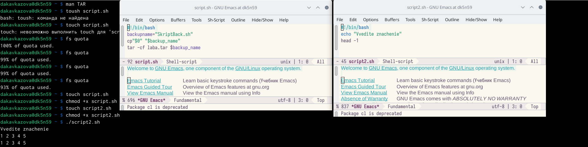
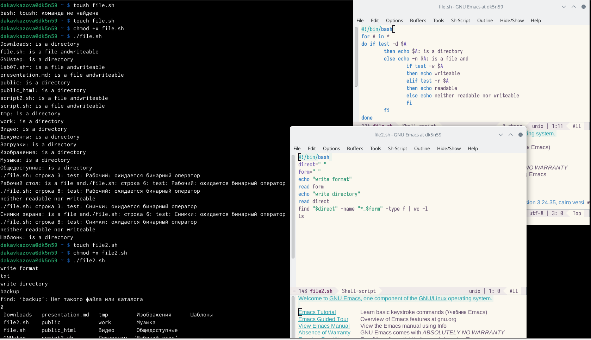

---
## Front matter
lang: ru-RU
title: Лабораторная работа №10
subtitle: Кавказова Диана Алексеевна
author:
author:
  - Кавказова Д.А.
institute:
  - Российский университет дружбы народов, Москва, Россия
date: 13 апреля 2023

## i18n babel
babel-lang: russian
babel-otherlangs: english

## Formatting pdf
toc: false
toc-title: Содержание
slide_level: 2
aspectratio: 169
section-titles: true
theme: metropolis
header-includes:
 - \metroset{progressbar=frametitle,sectionpage=progressbar,numbering=fraction}
 - '\makeatletter'
 - '\beamer@ignorenonframefalse'
 - '\makeatother'
---

# Информация

## Докладчик

:::::::::::::: {.columns align=center}
::: {.column width="70%"}

  * Кваказова Диана Алексеевна
  * НБИбд-01-22
  * Российский университет дружбы народов
  
:::
::::::::::::::

## Актуальность

- Для учащихся в сфере IT необходимо уметь работать с файлами через терминал на основе Linux.

## Объект и предмет исследования

- Основы интерфейса взаимодействия
пользователя с системой Unix на уровне командной строки
- Операционные системы

## Цели и задачи

- Изучить материал по созданию лабораторной
- Выполнить необходимые действия поэтапно

## шаг 1

- 1. Выполняем первые два пункта задания: Написали скрипт, который при запуске будет делать резервную копию самого себя, файл архивируется одним из архиваторов tar.

- 2. Написать пример командного файла, обрабатывающего любое произвольное число
аргументов командной строки, в том числе превышающее десять.

{#fig:001 width=95%}

## шаг 2

- Написали командный файл — аналог команды ls. Он выдавал информацию о нужном каталоге
и вывел  информацию о возможностях доступа к файлам этого каталога.
- Написали командный файл, который получает в качестве аргумента командной строки
формат файла (.txt) и вычислил количество таких файлов
в указанной директории. Путь к директории также передаётся в виде аргумента командной строки.
 
{#fig:002 width=95%}

## Вывод

Познакомились с операционной системой Linux. Получили практические навыки рабо-
ты с редактором vi, установленным по умолчанию практически во всех дистрибутивах.

:::
