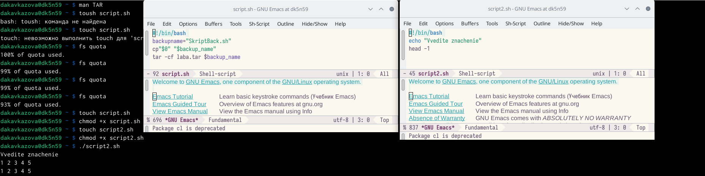
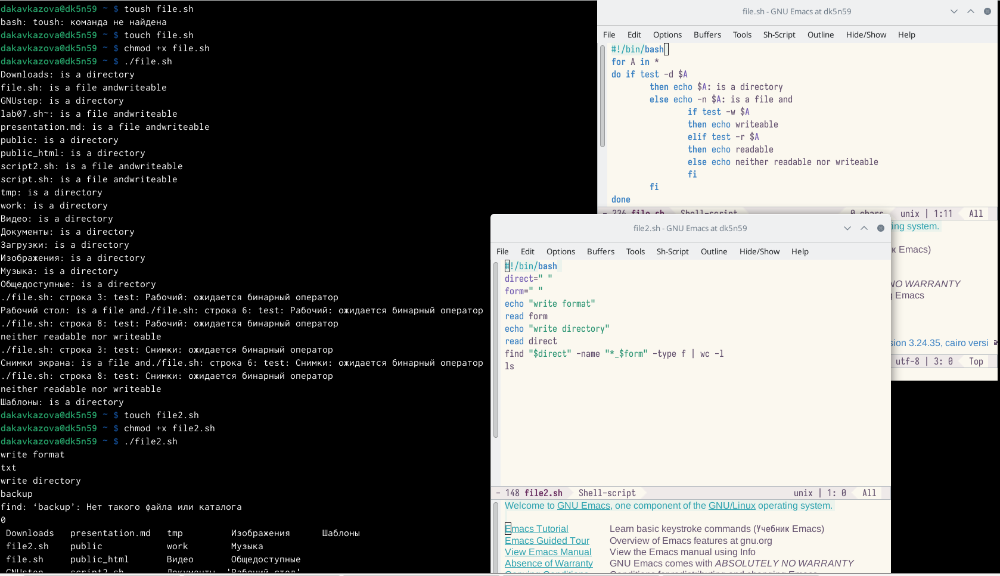

---
## Front matter
title: "Лабораторная работа №10"
subtitle: "Операционные системы"
author: "Кавказова Диана Алексеевна"

## Generic otions
lang: ru-RU
toc-title: "Содержание"

## Bibliography
bibliography: bib/cite.bib
csl: pandoc/csl/gost-r-7-0-5-2008-numeric.csl

## Pdf output format
toc: true # Table of contents
toc-depth: 2
lof: true # List of figures
lot: true # List of tables
fontsize: 12pt
linestretch: 1.5
papersize: a4
documentclass: scrreprt
## I18n polyglossia
polyglossia-lang:
  name: russian
  options:
	- spelling=modern
	- babelshorthands=true
polyglossia-otherlangs:
  name: english
## I18n babel
babel-lang: russian
babel-otherlangs: english
## Fonts
mainfont: PT Serif
romanfont: PT Serif
sansfont: PT Sans
monofont: PT Mono
mainfontoptions: Ligatures=TeX
romanfontoptions: Ligatures=TeX
sansfontoptions: Ligatures=TeX,Scale=MatchLowercase
monofontoptions: Scale=MatchLowercase,Scale=0.9
## Biblatex
biblatex: true
biblio-style: "gost-numeric"
biblatexoptions:
  - parentracker=true
  - backend=biber
  - hyperref=auto
  - language=auto
  - autolang=other*
  - citestyle=gost-numeric
## Pandoc-crossref LaTeX customization
figureTitle: "Рис."
tableTitle: "Таблица"
listingTitle: "Листинг"
lofTitle: "Список иллюстраций"
lotTitle: "Список таблиц"
lolTitle: "Листинги"
## Misc options
indent: true
header-includes:
  - \usepackage{indentfirst}
  - \usepackage{float} # keep figures where there are in the text
  - \floatplacement{figure}{H} # keep figures where there are in the text
---

# Цель работы

Изучить основы программирования в оболочке ОС UNIX/Linux. Научиться писать
небольшие командные файлы.

# Задание
1. Написать скрипт, который при запуске будет делать резервную копию самого себя (то
есть файла, в котором содержится его исходный код) в другую директорию backup
в вашем домашнем каталоге. При этом файл должен архивироваться одним из ар-
хиваторов на выбор zip, bzip2 или tar. Способ использования команд архивации
необходимо узнать, изучив справку.
2. Написать пример командного файла, обрабатывающего любое произвольное число
аргументов командной строки, в том числе превышающее десять. Например, скрипт
может последовательно распечатывать значения всех переданных аргументов.
3. Написать командный файл — аналог команды ls (без использования самой этой ко-
манды и команды dir). Требуется, чтобы он выдавал информацию о нужном каталоге
и выводил информацию о возможностях доступа к файлам этого каталога.
4. Написать командный файл, который получает в качестве аргумента командной строки
формат файла (.txt, .doc, .jpg, .pdf и т.д.) и вычисляет количество таких файлов
в указанной директории. Путь к директории также передаётся в виде аргумента ко-
мандной строки.

# Выполнение лабораторной работы

1. Выполняем первые два пункта задания: Написали скрипт, который при запуске будет делать резервную копию самого себя, файл архивируется одним из архиваторов tar.

2. Написать пример командного файла, обрабатывающего любое произвольное число
аргументов командной строки, в том числе превышающее десять.

{#fig:001 width=90%}

3. Написали командный файл — аналог команды ls. Он выдавал информацию о нужном каталоге
и вывел  информацию о возможностях доступа к файлам этого каталога.
4. Написали командный файл, который получает в качестве аргумента командной строки
формат файла (.txt) и вычислил количество таких файлов
в указанной директории. Путь к директории также передаётся в виде аргумента командной строки.

{#fig:001 width=90%}

# Контрольные вопросы
1. Объясните понятие командной оболочки. Приведите примеры командных оболочек.
Чем они отличаются?
2. Что такое POSIX?
3. Как определяются переменные и массивы в языке программирования bash?
4. Каково назначение операторов let и read?
5. Какие арифметические операции можно применять в языке программирования bash?
6. Что означает операция (( ))?
7. Какие стандартные имена переменных Вам известны?
8. Что такое метасимволы?
9. Как экранировать метасимволы?
10. Как создавать и запускать командные файлы?
11. Как определяются функции в языке программирования bash?
12. Каким образом можно выяснить, является файл каталогом или обычным файлом?
13. Каково назначение команд set, typeset и unset?
14. Как передаются параметры в командные файлы?
15. Назовите специальные переменные языка bash и их назначение.

# Выводы

Изучили основы программирования в оболочке ОС UNIX/Linux. Научились писать
небольшие командные файлы.

# Список литературы{.unnumbered}

::: {#refs}
:::
