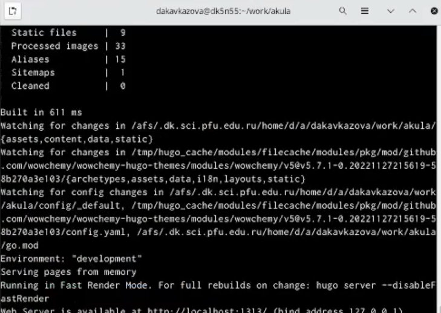
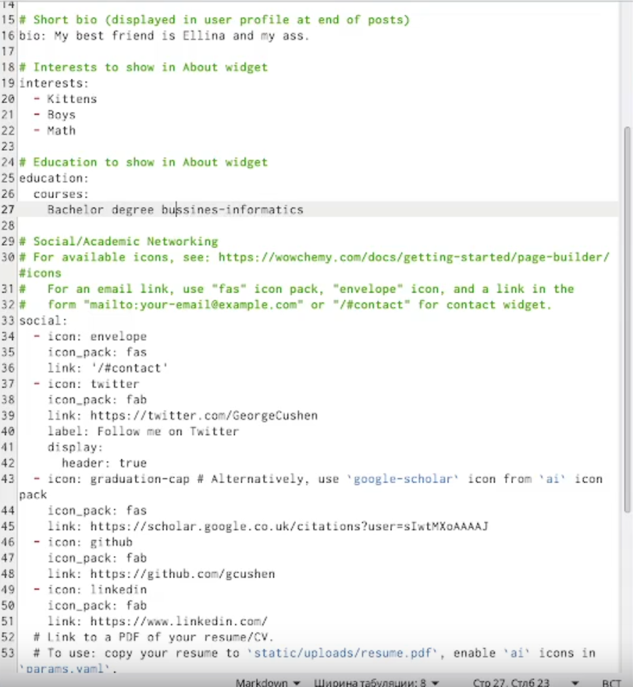
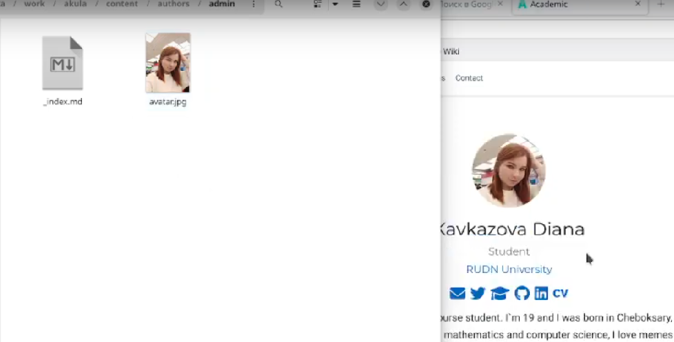
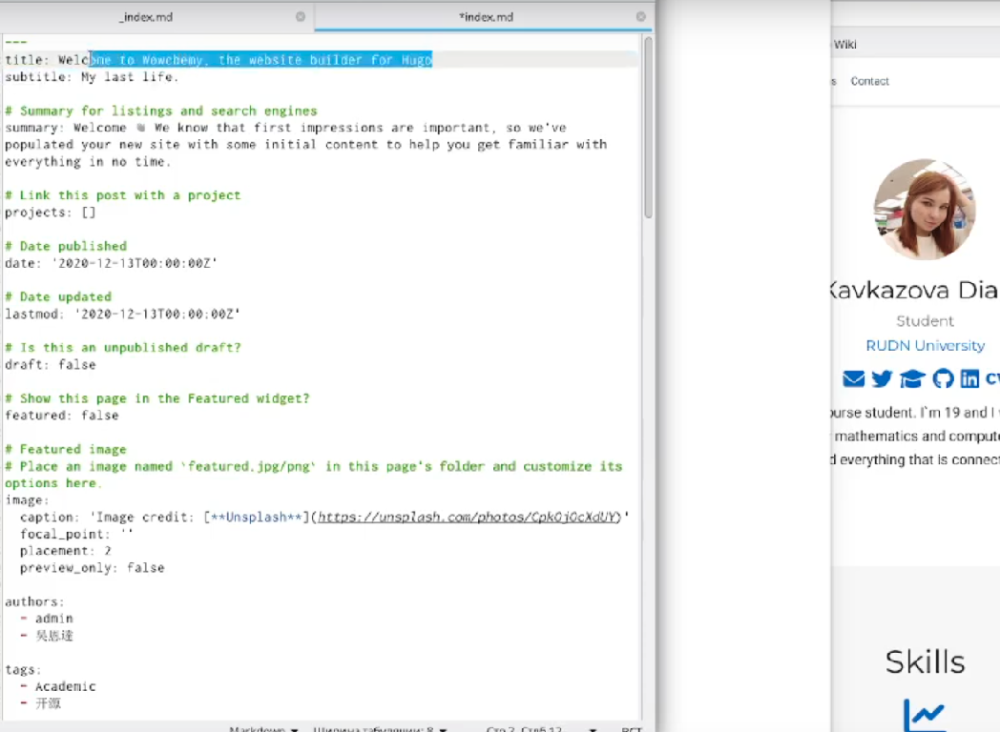
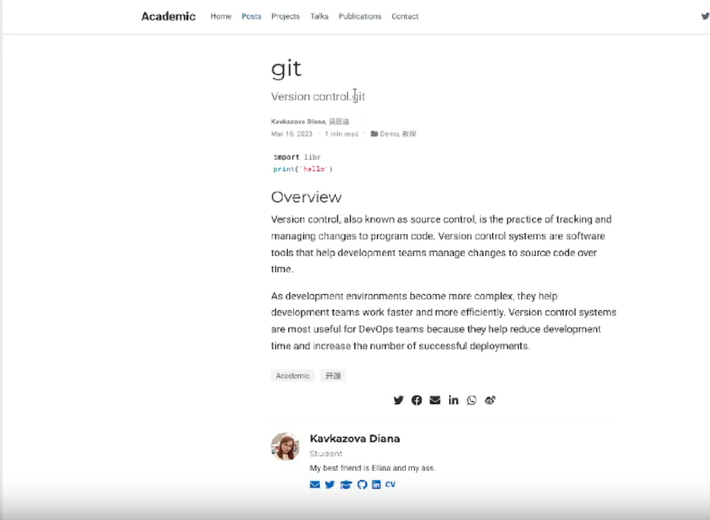

---
## Front matter
lang: ru-RU
title: Индивидуальный проект этап 2
subtitle: Кавказова Диана Алексеевна
author:
author:
  - Кавказова Д.А.
institute:
  - Российский университет дружбы народов, Москва, Россия
date: 17 марта 2023

## i18n babel
babel-lang: russian
babel-otherlangs: english

## Formatting pdf
toc: false
toc-title: Содержание
slide_level: 2
aspectratio: 169
section-titles: true
theme: metropolis
header-includes:
 - \metroset{progressbar=frametitle,sectionpage=progressbar,numbering=fraction}
 - '\makeatletter'
 - '\beamer@ignorenonframefalse'
 - '\makeatother'
---


## Докладчик

  * Кваказова Диана Алексеевна
  * НБИбд-01-22
  * Российский университет дружбы народов
  
:::
::::::::::::::


## Актуальность

- Для учащихся в сфере IT необходимо уметь работать с файлами через терминал на основе Linux.

## Код для формата `pdf`

```yaml
slide_level: 2
aspectratio: 169
section-titles: true
theme: metropolis
```

## Формат `html`

- Используется фреймворк [reveal.js](https://revealjs.com/)
- Используется [тема](https://revealjs.com/themes/) `beige`

## Код для формата `html`

- Тема задаётся в файле `Makefile`

```make
REVEALJS_THEME = beige 
```

## Объект и предмет исследования

- Сайт
- Операционные системы

## Цели и задачи

- Изучить материал по созданию сайта
- Выполнить необходимые действия поэтапно


## шаг 1

- Все изменения в маркдауне мы фиксируем через терминал командой ~/bin/hugo server и получаем ссылку на сайт.

{#fig:001 width=95%}

## шаг 2

- Открываем файл _index.md в content/authors/admin и редактируем о себе личную информацию в нескольких строках.

{#fig:002 width=95%}

## шаг 3

- Открываем content/authors/admin и вставляем свою фотографию, которая потом бкдет в профиле

{#fig:003 width=95%}

## шаг 4

- Создаём подтему в /content/post для этого редактируем маркдаун и дописываем информацию о прошедшей неделе.

{#fig:004 width=95%}

## шаг 5

- Создаём пост в /content/post/git c нуля о непрерывной интеграция и непрерывном развертывание (CI/CD).

{#fig:005 width=95%}


:::
