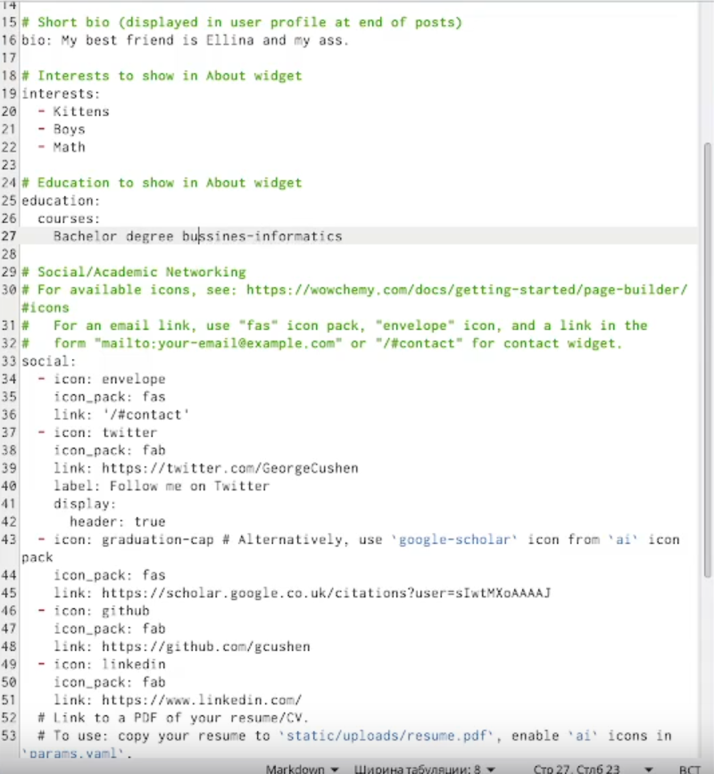
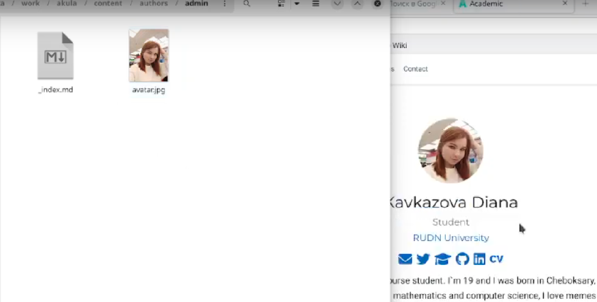
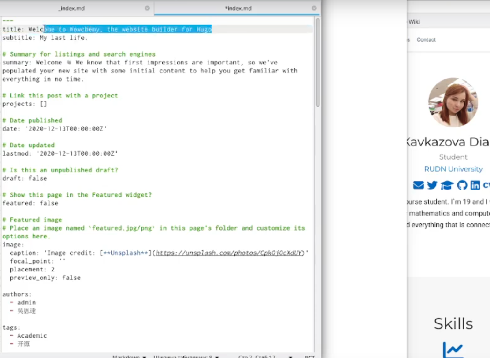
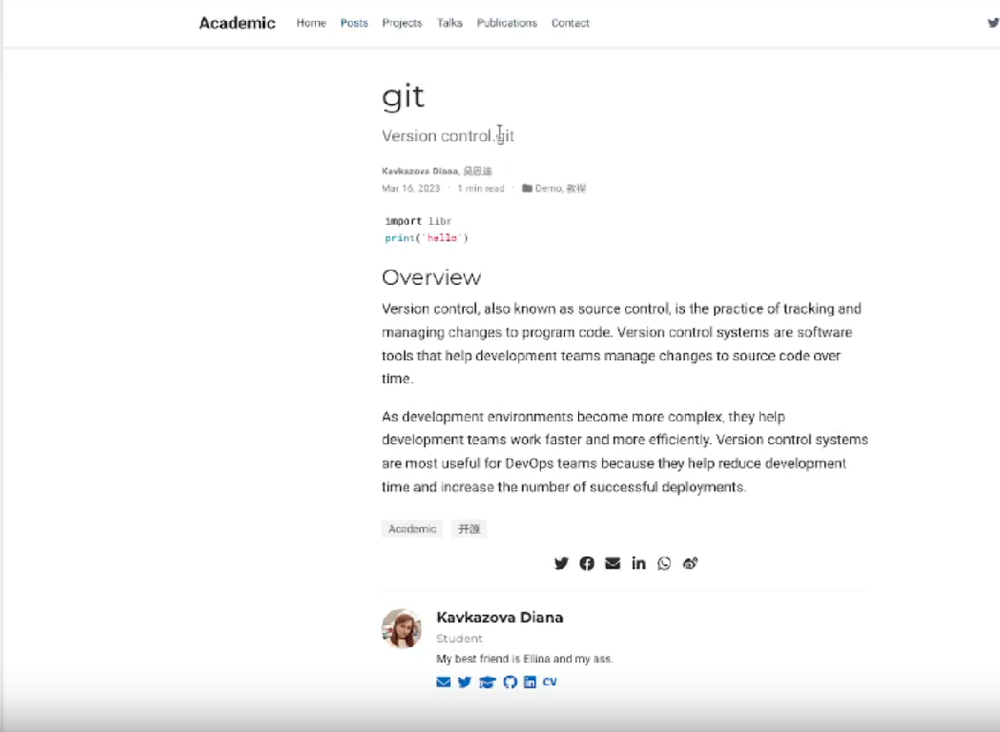

---
## Front matter
title: "Индивидуальный проект 2 этап"
subtitle: "Операционные системы"
author: "Кавказова Диана Алексеевна"

## Generic otions
lang: ru-RU
toc-title: "Содержание"

## Bibliography
bibliography: bib/cite.bib
csl: pandoc/csl/gost-r-7-0-5-2008-numeric.csl

## Pdf output format
toc: true # Table of contents
toc-depth: 2
lof: true # List of figures
lot: true # List of tables
fontsize: 12pt
linestretch: 1.5
papersize: a4
documentclass: scrreprt
## I18n polyglossia
polyglossia-lang:
  name: russian
  options:
	- spelling=modern
	- babelshorthands=true
polyglossia-otherlangs:
  name: english
## I18n babel
babel-lang: russian
babel-otherlangs: english
## Fonts
mainfont: PT Serif
romanfont: PT Serif
sansfont: PT Sans
monofont: PT Mono
mainfontoptions: Ligatures=TeX
romanfontoptions: Ligatures=TeX
sansfontoptions: Ligatures=TeX,Scale=MatchLowercase
monofontoptions: Scale=MatchLowercase,Scale=0.9
## Biblatex
biblatex: true
biblio-style: "gost-numeric"
biblatexoptions:
  - parentracker=true
  - backend=biber
  - hyperref=auto
  - language=auto
  - autolang=other*
  - citestyle=gost-numeric
## Pandoc-crossref LaTeX customization
figureTitle: "Рис."
tableTitle: "Таблица"
listingTitle: "Листинг"
lofTitle: "Список иллюстраций"
lotTitle: "Список таблиц"
lolTitle: "Листинги"
## Misc options
indent: true
header-includes:
  - \usepackage{indentfirst}
  - \usepackage{float} # keep figures where there are in the text
  - \floatplacement{figure}{H} # keep figures where there are in the text
---

# Цель работы

Изучение и создание сайта на основе шаблона. Редактирование сайта через каталоги и маркдаун.
# Задание

Добавить к сайту данные о себе.

Список добавляемых данных.
Разместить фотографию владельца сайта.
Разместить краткое описание владельца сайта (Biography).
Добавить информацию об интересах (Interests).
Добавить информацию от образовании (Education).
Сделать пост по прошедшей неделе.
Непрерывная интеграция и непрерывное развертывание (CI/CD).

# Выполнение лабораторной работы

1. Все изменения в маркдауне мы фиксируем через терминал командой ~/bin/hugo server и получаем ссылку на сайт.

{#fig:001 width=95%}

2. Открываем файл _index.md в content/authors/admin и редактируем о себе личную информацию в нескольких строках.
 
{#fig:002 width=95%}

3. Открываем content/authors/admin и вставляем свою фотографию, которая потом бкдет в профиле

{#fig:003 width=95%}

4. Создаём подтему в /content/post для этого редактируем маркдаун и дописываем информацию о прошедшей неделе.

{#fig:004 width=95%}

5.  Создаём пост в /content/post/git c нуля о непрерывной интеграция и непрерывном развертывание (CI/CD).

{#fig:005 width=95%}

# Выводы

Мы освоили навыки по заполнению личных данных на сайте, а также научились создавать отдельные подтемы.

# Список литературы{.unnumbered}

::: {#refs}
:::
