---
## Front matter
lang: ru-RU
title: Структура научной презентации
subtitle: Простейший шаблон
author:
  - Кавказова Д.А.
institute:
  - Российский университет дружбы народов, Москва, Россия
date: 22 февраляя 2023

## i18n babel
babel-lang: russian
babel-otherlangs: english

## Formatting pdf
toc: false
toc-title: Содержание
slide_level: 2
aspectratio: 169
section-titles: true
theme: metropolis
header-includes:
 - \metroset{progressbar=frametitle,sectionpage=progressbar,numbering=fraction}
 - '\makeatletter'
 - '\beamer@ignorenonframefalse'
 - '\makeatother'
---

# Информация

## Докладчик

:::::::::::::: {.columns align=center}
::: {.column width="70%"}

  * Кваказова Диана Алексеевна
  * НБИбд-01-22
  * Российский университет дружбы народов
  
:::
::::::::::::::

# Вводная часть

## Актуальность

- Для учащихся в сфере IT необходимы навыки создания простейших сайтов на основе шаблона. Данная деятельность пользуется высокой популярностью у фирм и разных компаний в связи с развитием современного мира.
## Объект и предмет исследования

- Презентация как текст
- Программное обеспечение для создания презентаций
- Входные и выходные форматы презентаций

## Цели и задачи

- Изучить видеоматериал по созданию сайта
- Выполнить необходимые действия поэтапно 

## Материалы и методы

- Процессор `pandoc` для входного формата Markdown
- Результирующие форматы
	- `pdf`
	- `html`
- Автоматизация процесса создания: `Makefile`

# Создание презентации

## шаг 1

- Скачиваем файл с сайта и разархивируем в созданном каталоге bin. Далее создаем репозиторий на основе инструкций. Клонируем и получаем новый репозиторий

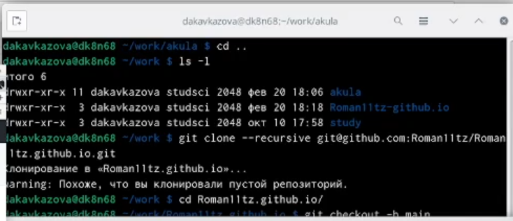{#fig:001 width=95%}

## шаг 2 

-  Далее выполняем команды по порядку и получаем ссылку на свой редактируемый сайт.

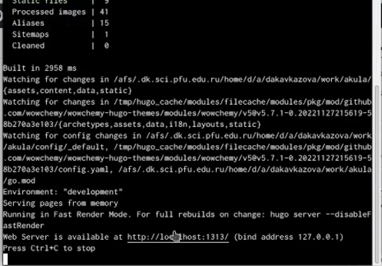{#fig:002 width=95%}

## шаг 3

-  Открываем сайт, позже заходим в файл _index.md и удаляем строчки с 8 по 37. Тем самым убирая лишний синий фон.

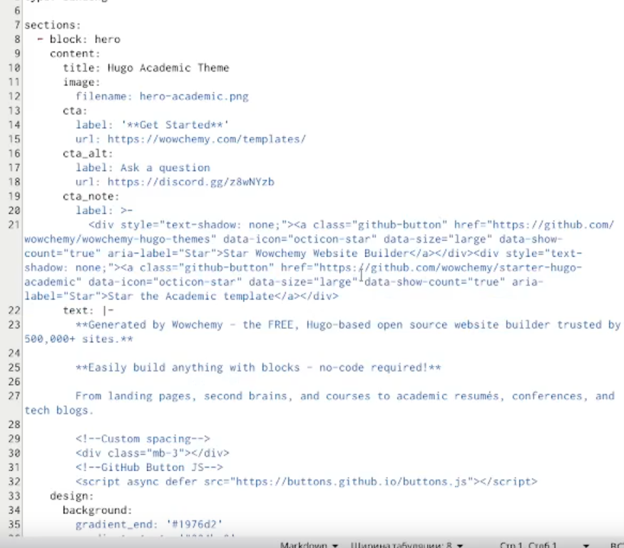{#fig:003 width=95%}

## шаг 4

-  Копируем SSH ключ.

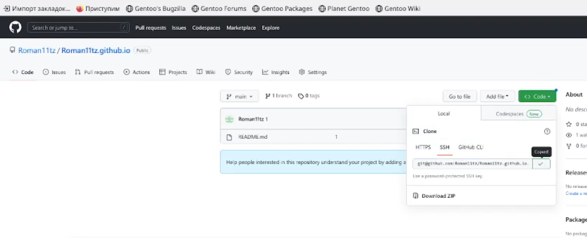{#fig:004 width=95%}

## шаг 5

-  В наших созданных репозиториях вносим изменеия и прослеживаем этапы создания файлов, а также наполненность.В конце убеждаемся что есть ошибка с 'public' 

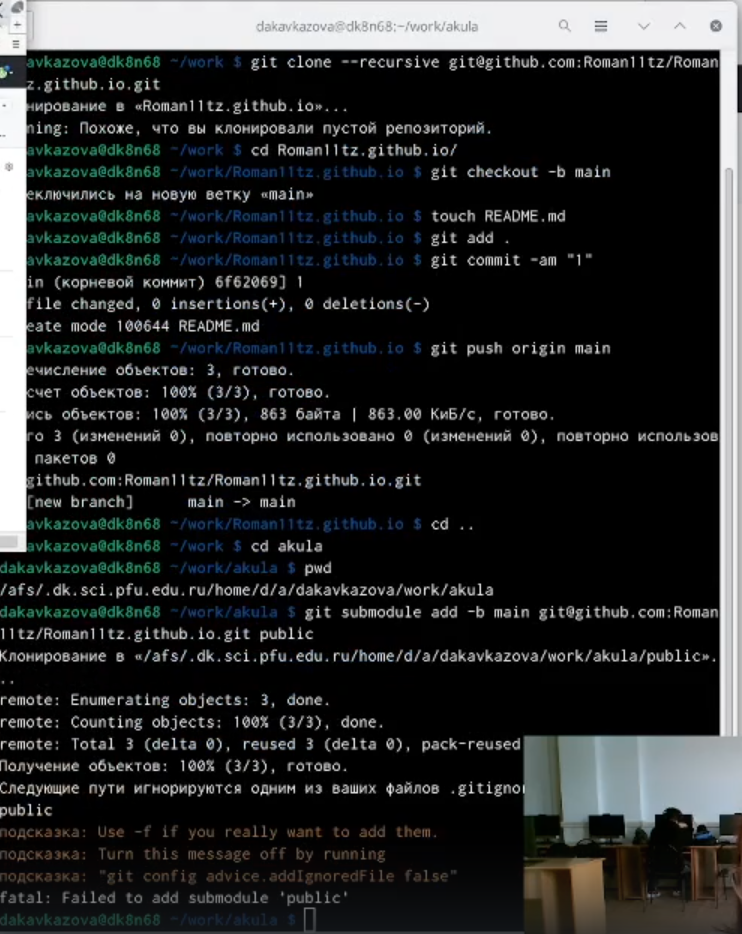{#fig:005 width=95%}

## шаг 6

-  Устраняем ошибку за счёт открытия mc, находим в 'public'строчку и дописываем #. После вновь возвращаемся к команде bin/hugo

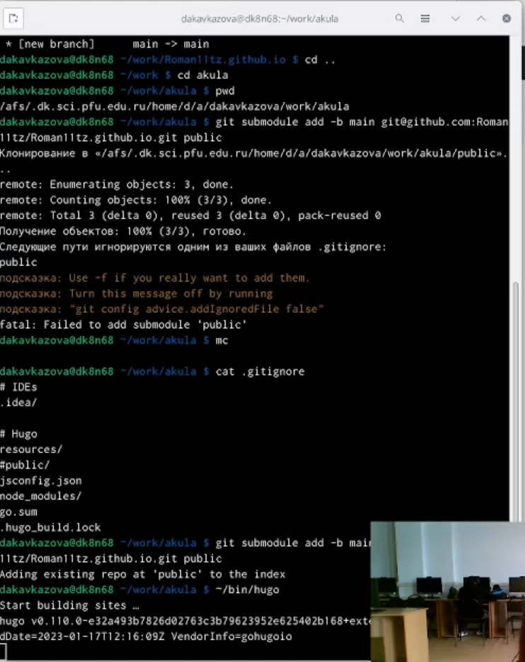{#fig:006 width=95%}

## шаг 7

- Удаляем gitignore и выполняем следующую команду  git submodule

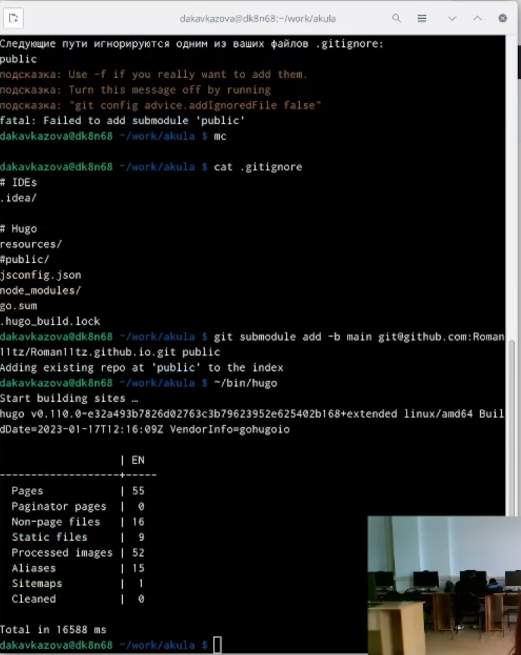{#fig:007 width=95%}

## шаг 8

- Убеждаемся в полном наличии файлов.

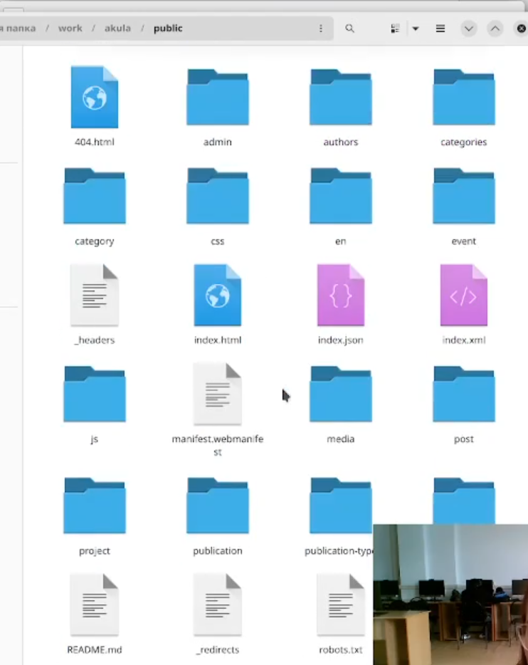{#fig:008 width=95%}

## шаг 9

- Выполняем  git remote

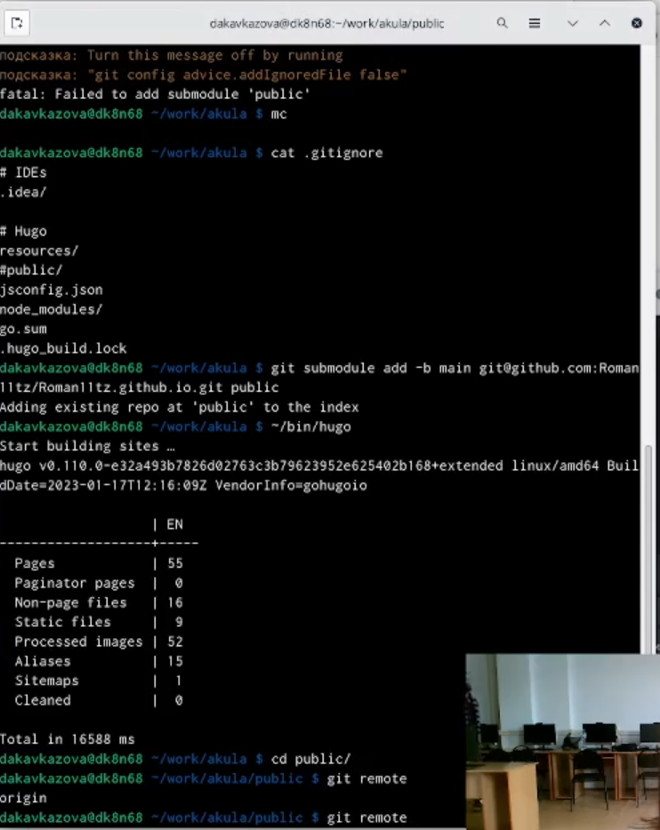{#fig:009 width=95%}

## шаг 10

-  Выполняем  добавление изменений в репозиторий через терминал и убеждаемся в полном наличии файлов.

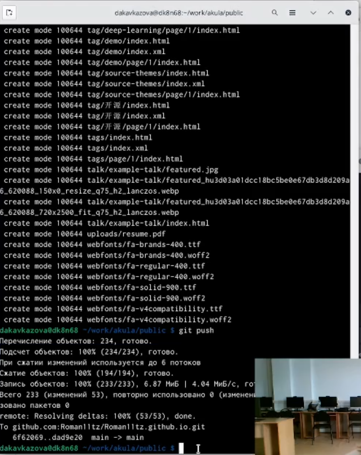{#fig:010 width=95%}

## шаг 11

- Репозитории созданы корректно и сайт функционирует.

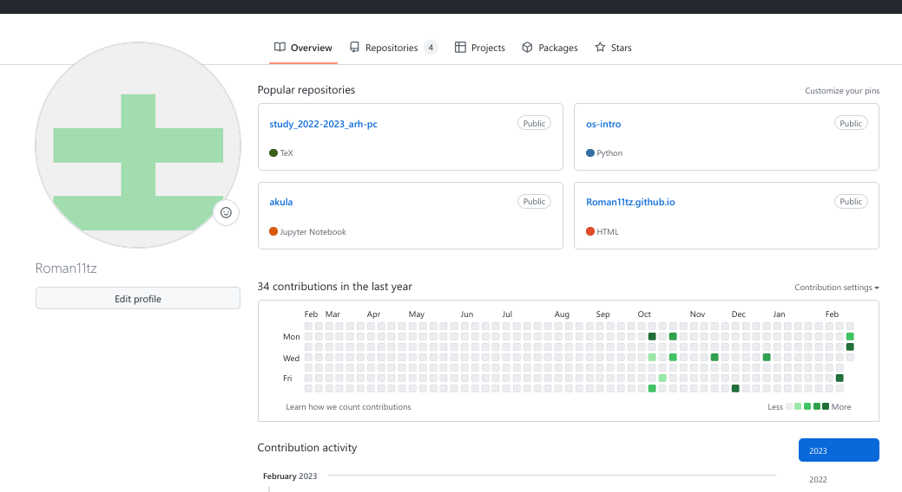{#fig:011 width=95%}

:::

