---
## Front matter
title: "Индивидуальный проект"
subtitle: "Операционные системы"
author: "Кавказова Диана Алексеевна"

## Generic otions
lang: ru-RU
toc-title: "Содержание"

## Bibliography
bibliography: bib/cite.bib
csl: pandoc/csl/gost-r-7-0-5-2008-numeric.csl

## Pdf output format
toc: true # Table of contents
toc-depth: 2
lof: true # List of figures
lot: true # List of tables
fontsize: 12pt
linestretch: 1.5
papersize: a4
documentclass: scrreprt
## I18n polyglossia
polyglossia-lang:
  name: russian
  options:
	- spelling=modern
	- babelshorthands=true
polyglossia-otherlangs:
  name: english
## I18n babel
babel-lang: russian
babel-otherlangs: english
## Fonts
mainfont: PT Serif
romanfont: PT Serif
sansfont: PT Sans
monofont: PT Mono
mainfontoptions: Ligatures=TeX
romanfontoptions: Ligatures=TeX
sansfontoptions: Ligatures=TeX,Scale=MatchLowercase
monofontoptions: Scale=MatchLowercase,Scale=0.9
## Biblatex
biblatex: true
biblio-style: "gost-numeric"
biblatexoptions:
  - parentracker=true
  - backend=biber
  - hyperref=auto
  - language=auto
  - autolang=other*
  - citestyle=gost-numeric
## Pandoc-crossref LaTeX customization
figureTitle: "Рис."
tableTitle: "Таблица"
listingTitle: "Листинг"
lofTitle: "Список иллюстраций"
lotTitle: "Список таблиц"
lolTitle: "Листинги"
## Misc options
indent: true
header-includes:
  - \usepackage{indentfirst}
  - \usepackage{float} # keep figures where there are in the text
  - \floatplacement{figure}{H} # keep figures where there are in the text
---

# Цель работы

Создание сайта при помощи редактирования готового шаблона через .md.
# Задание

Выполнить индивидуальный проект по видеоинструкции. Этап 1.

# Выполнение лабораторной работы
1. Скачиваем файл с сайта и разархивируем в созданном каталоге bin. Далее создаем репозиторий на основе инструкций. Клонируем и получаем новый репозиторий

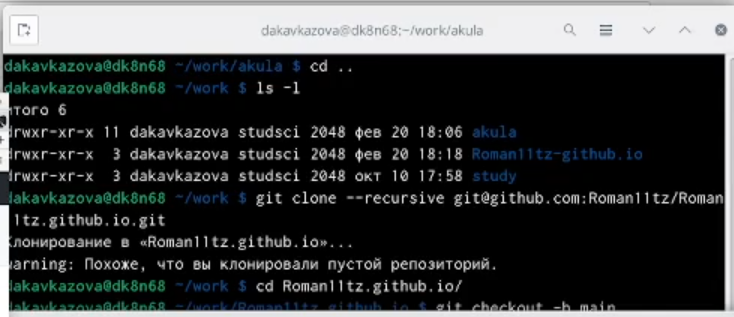{#fig:001 width=95%}

2. Далее выполняем команды по порядку и получаем ссылку на свой редактируемый сайт.

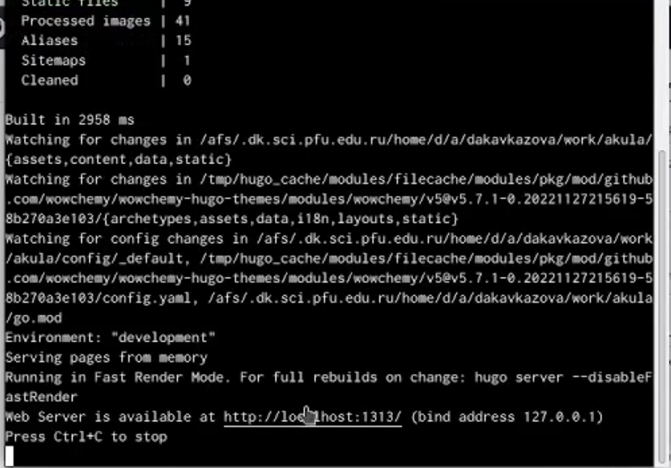{#fig:002 width=95%}

3. Открываем сайт, позже заходим в файл _index.md и удаляем строчки с 8 по 37. Тем самым убирая лишний синий фон.

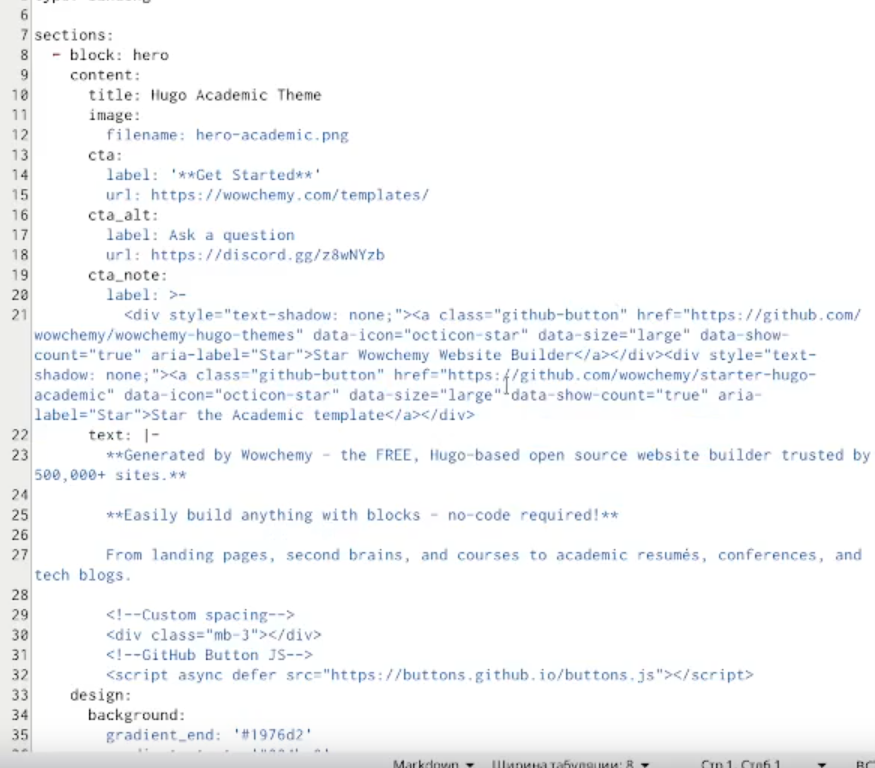{#fig:003 width=95%}

4. Копируем SSH ключ.

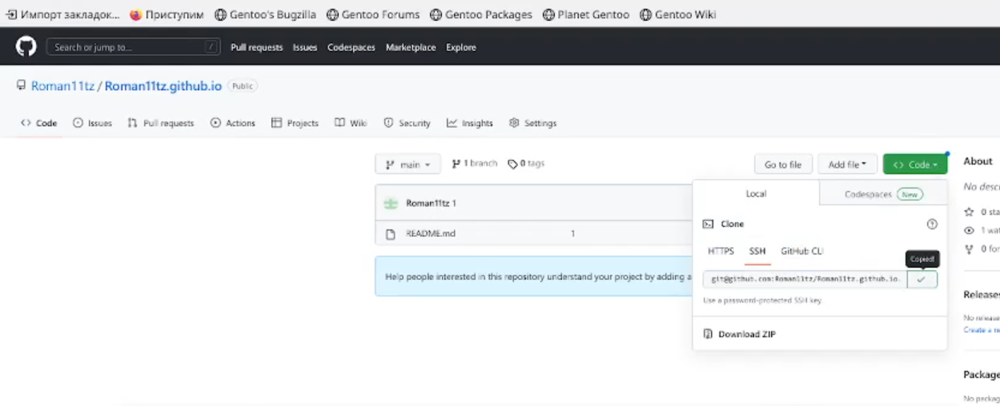{#fig:004 width=95%}

5. В наших созданных репозиториях вносим изменеия и прослеживаем этапы создания файлов, а также наполненность.В конце убеждаемся что есть ошибка с 'public' 

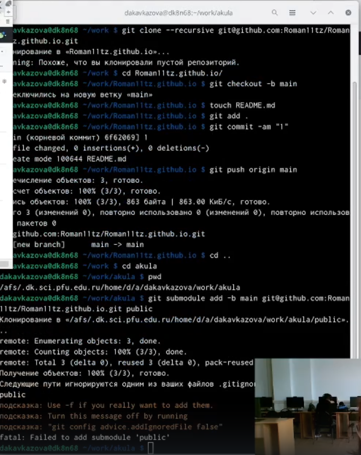{#fig:005 width=95%}

6. Устраняем ошибку за счёт открытия mc, находим в 'public'строчку и дописываем #. После вновь возвращаемся к команде bin/hugo

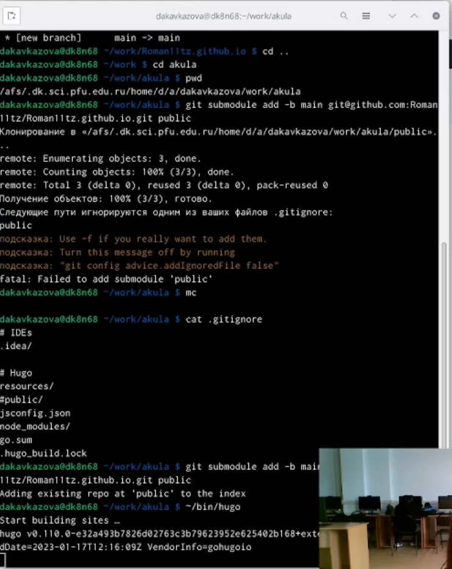{#fig:006 width=95%}

7. Удаляем gitignore и выполняем следующую команду  git submodule

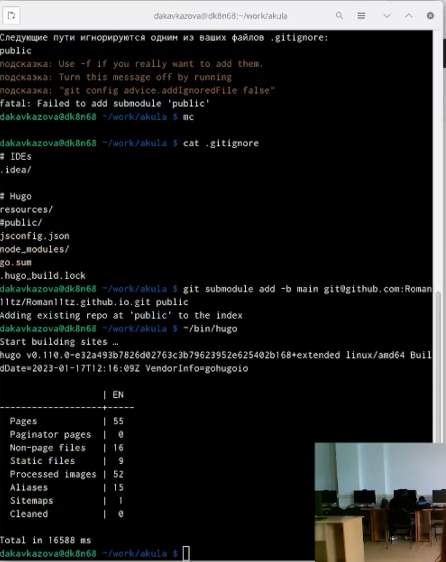{#fig:007 width=95%}

8. Убеждаемся в полном наличии файлов.

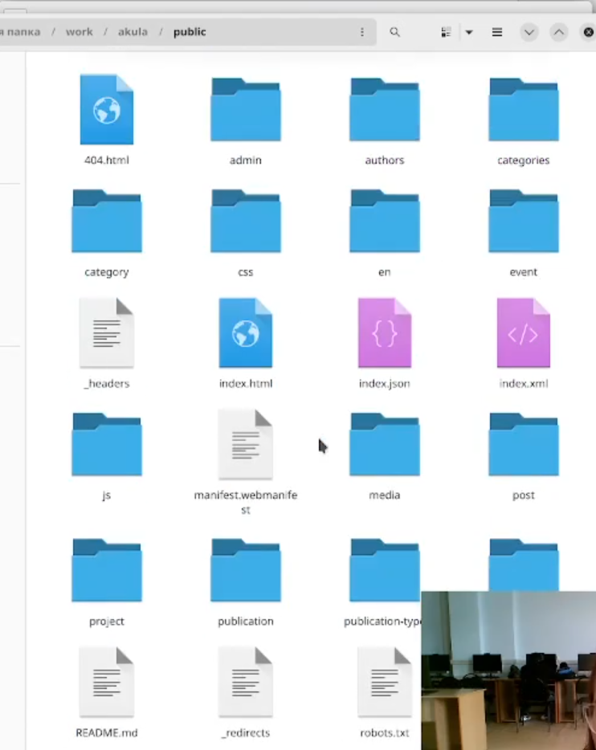{#fig:008 width=95%}

9. Выполняем  git remote

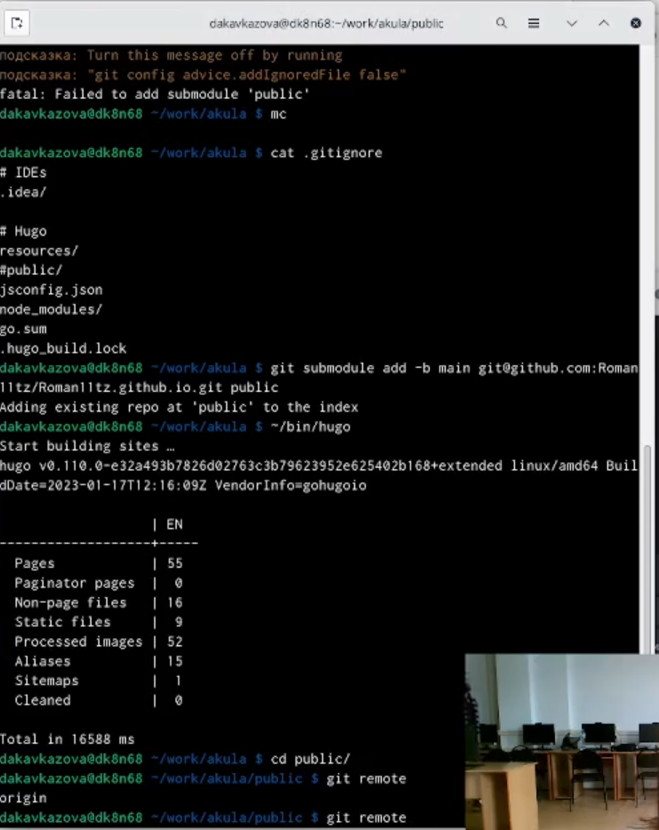{#fig:009 width=95%}

10. Выполняем  добавление изменений в репозиторий через терминал и убеждаемся в полном наличии файлов.

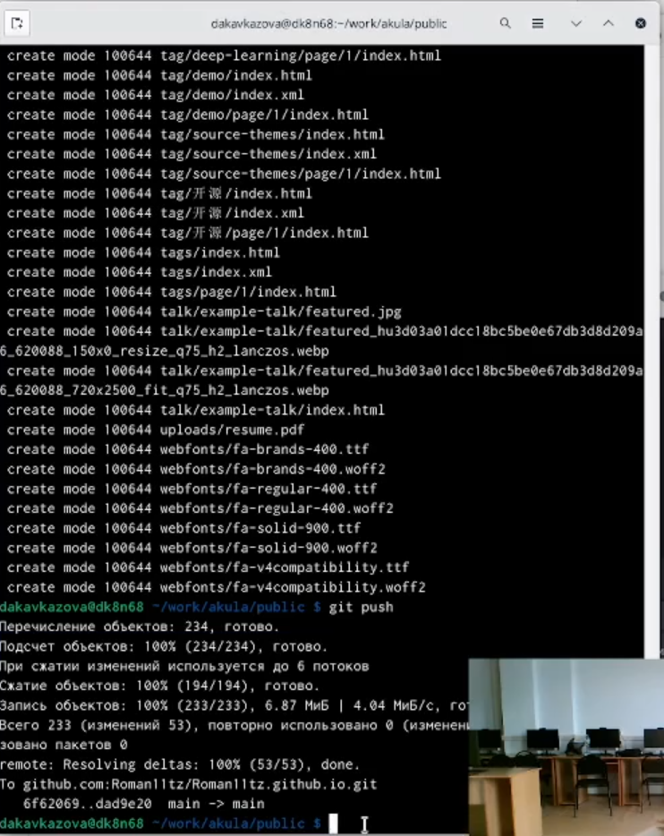{#fig:010 width=95%}

11. Репозитории созданы корректно и сайт функционирует.

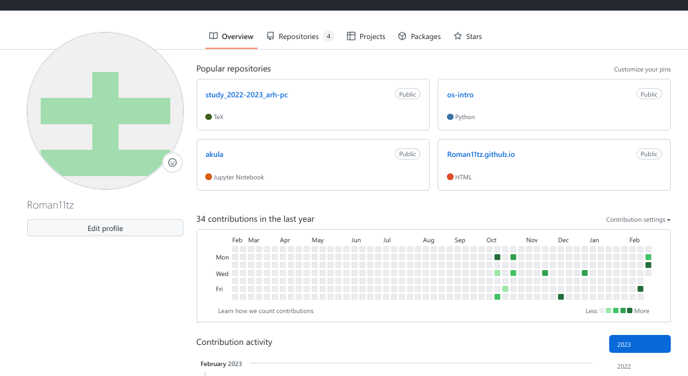{#fig:011 width=95%}

# Выводы

В итоге первой работы над индивидуальным проектом мы изучили структуру сайта через маркдаун и узнали что отдельные колонки на сайте имеют отдельные каталоги на компьютере и несут внутри себя различную информацию. Мы создали два репозитория для работы с нашим проектом. Научились редактировать внутрисодержимое проекта.

# Список литературы{.unnumbered}

::: {#refs}
:::
